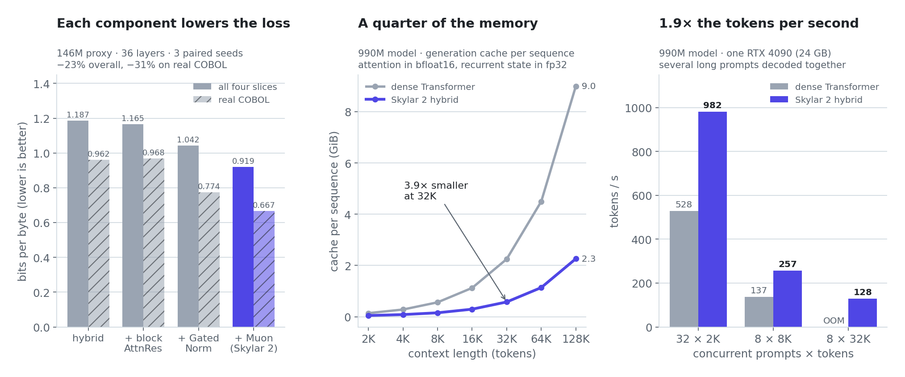
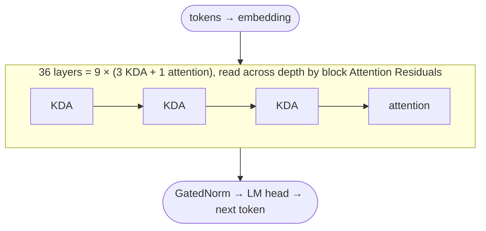
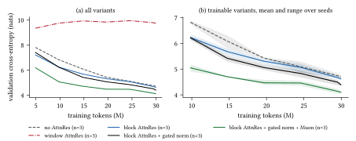
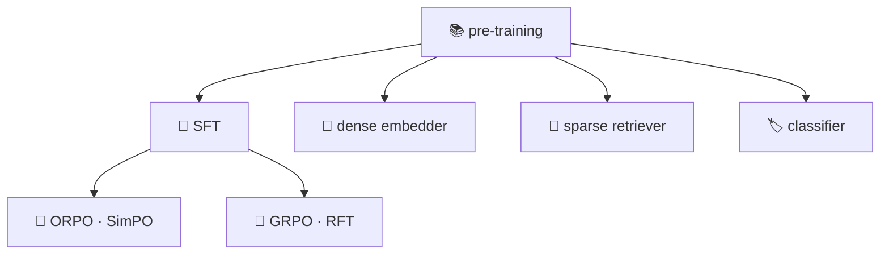

<div align="center">

<picture>
  <source media="(prefers-color-scheme: dark)" srcset="docs/brand/skylar-logo-dark-2048.png">
  
</picture>

### A from-scratch language-model framework, and the small local models it trains for legacy code.

[](https://python.org)
[](https://pytorch.org)
[](https://huggingface.co/Skyl4r-Ai)
[](https://pypi.org/project/skylar/)
[](docs/PAPER_V2.md)
[](LICENSE)

**by [A. Ivanovitch](https://www.linkedin.com/in/aleksandr-ivanovitch-brunelli), CEO [SKYL4R](https://skyl4r.ai)**

</div>

<br>

Every layer, every rotation, every gradient is written by hand in plain PyTorch, with no black boxes and
no third-party weights: from a 9M test model to 128B-parameter presets, from raw documents to a chat
model, in one codebase that stays readable.

<div align="center">

### ⌨️ Skylar writes COBOL. It compiles, runs, and returns the right answer. 100% local, 100% from scratch.


</div>

On **COBOLEval** (146 problems, compiled and executed by GnuCOBOL, same harness for every model),
**Skylar-980M-Cobol beats Qwen2.5-Coder-7B, CodeLlama-7B and StarCoder2-7B** on both compile rate and
pass@1, with about 7× fewer parameters, fully local and trained from scratch. It is a research preview
and a COBOL specialist, not a general chatbot: read the
[model card](https://huggingface.co/Skyl4r-Ai/Skylar-980M-Cobol).

```bash
pip install skylar

# the COBOL specialist: writes, explains and modifies COBOL, 100% local
skylar chat --model Skyl4r-Ai/Skylar-980M-Cobol --system "Sei un esperto programmatore COBOL."

# Italian chat and semantic retrieval (236M)
skylar chat  --model Skyl4r-Ai/Skylar-236M-Chat
skylar embed --model Skyl4r-Ai/Skylar-236M-Embed --query "prestito casa" --docs "mutuo" "meteo"
```

## 🆕 Skylar 2

The next architecture, built for long programs read whole on local hardware: three recurrent layers for
every attention layer, attention over depth instead of a plain residual sum, gated normalisation and the
Muon optimiser. With the options off it is the previous decoder, bit for bit.

<picture>
  <source media="(prefers-color-scheme: dark)" srcset="docs/img/skylar2_glance_dark.png">
  
</picture>



| component | what it does |
|:--|:--|
| **KDA hybrid, 3:1** | 27 of 36 layers keep a fixed-size recurrent state instead of a cache that grows with the context; every fourth layer keeps full attention for exact recall |
| **Block Attention Residuals** | each sub-layer reads a learned mixture of earlier depths, on a fused kernel that makes the step 7% faster |
| **GatedNorm** | a low-rank gate after each normalisation, which rescales without the activation outliers behind loss spikes |
| **SiTU-GLU** | a bounded SwiGLU, for low-precision inference without retraining |
| **Muon** | the optimiser for the hidden matrices; flat over a 4× range of learning rates |

The 990M model trains at **53,000 tokens/s on one B200**, and has run on 2 nodes × 4 A100 with a resume on every node.
**No Skylar 2 model has been trained at scale yet.** Architecture, flags and numbers:
[`models/`](models/README.md) · full report: [`docs/PAPER_V2.md`](docs/PAPER_V2.md)
([PDF](docs/paper/skylar2_paper.pdf)).

<details>
<summary>📉 <b>Training curves of the ablation</b>, from the report</summary>
<br>


Validation cross-entropy over 30M tokens, mean of three seeds. The window variant of Attention Residuals
does not train at 36 layers; every adopted component improves on the one before.
</details>

## ⚡ Quick start

```bash
git clone https://github.com/skyl4r-ai/skylar.git && cd skylar
python -m venv .venv && source .venv/bin/activate
pip install -e .

# a model from scratch, on the GPU you have
python training/bin.pretrain.py --preset small \
    --data <tokenized_dir> --tokenizer <tokenizer.json> --out checkpoints/small

# talk to it after fine-tuning
python inference/bin.chat.py --model checkpoints_sft/best
```

## 🔄 One base, many products



The chat model, the retrieval models and the classifier all start from the same pre-trained weights.

| | what is inside |
|:--|:--|
| [**`models/`**](models/README.md) | Skylar 2, the base decoder (RMSNorm, RoPE, GQA, QK-Norm, SwiGLU, FlexAttention, µP), 17 presets |
| [**`training/`**](training/README.md) | pre-training from one GPU to several nodes, checkpoint merging, SFT, preference, RL, distillation, retrieval heads |
| [**`data/`**](data/README.md) | corpus builder with PII redaction and dedup, code-aware BPE, memory-mapped shards |
| [**`inference/`**](inference/README.md) | streaming chat, generation, embeddings |
| `eval/` | architecture gates, bits per byte, cache parity, Italian benchmarks, SFT diagnostics |

Everything is Hugging Face-native: `save_pretrained`, `from_pretrained`, `AutoModelForCausalLM` and
`push_to_hub` work as for any model.

## 📊 From 9M to 128B

| | presets and parameters |
|:--|:--|
| **small and research** | `test` 9M · `small` 52M · `small_plus` 88M · `medium` 125M · `medium_plus` 268M · `large` 381M · `gold` 426M |
| **the code line** | `1B` 1.04B · `1B_D` 1.0B · `2b` 2.1B |
| **Qwen3 shapes** | `4b` 3.8B · `8b` 7.2B · `14b` 13.5B · `32b` 31.5B |
| **frontier scale** | `64b` 62B · `96b` 100B · `128b` 128B |

Parameters with a 64,000-token vocabulary. The `4b` to `32b` presets have the shapes of the official
Qwen3 models, and every preset from `1B_D` up can be built as a Skylar 2 hybrid.
[All presets →](models/README.md#all-presets)

## 🤗 Published models

| model | size | what it is | result |
|:--|--:|:--|:--|
| [**Skylar-980M-Cobol**](https://huggingface.co/Skyl4r-Ai/Skylar-980M-Cobol) | 980M | COBOL specialist, instruction-tuned | COBOLEval: **80.1%** compile, **7.5%** pass@1 |
| [Skylar-980M-Cobol-Base](https://huggingface.co/Skyl4r-Ai/Skylar-980M-Cobol-Base) | 980M | its pre-trained base | |
| [Skylar-236M-Chat](https://huggingface.co/Skyl4r-Ai/Skylar-236M-Chat) | 236M | grounded Italian chat | 6/6 grounded tasks |
| [Skylar-236M-Embed](https://huggingface.co/Skyl4r-Ai/Skylar-236M-Embed) | 236M | Italian embeddings | SQuAD-it R@1 0.55 · nDCG@10 0.71 |
| [Skylar-236M-Base](https://huggingface.co/Skyl4r-Ai/Skylar-236M-Base) | 236M | Italian legal base | XCOPA-it 0.562 |

The 236M models were trained on 1.12B tokens of Italian legal text: what they do well, and where they
fall short, is in [`docs/RESULTS.md`](docs/RESULTS.md).

## 🗺️ Roadmap

- [x] From-scratch decoder, post-training suite, retrieval models, OpenAI-compatible server
- [x] COBOL specialist, validated on COBOLEval
- [x] Skylar 2 architecture and technical report
- [x] Multi-node training with a resume point on every node
- [ ] The first Skylar 2 model at scale (990M), head to head with Skylar-980M-Cobol
- [ ] Sharded training for the 4B and larger sizes
- [ ] Long-context training stages

## 📚 Documentation

| document | |
|:--|:--|
| [`docs/PAPER_V2.md`](docs/PAPER_V2.md) | Skylar 2 technical report ([PDF](docs/paper/skylar2_paper.pdf)) |
| [`docs/PAPER.md`](docs/PAPER.md) | the base decoder |
| [`docs/RESULTS.md`](docs/RESULTS.md) | validated results of the 236M models |
| [`docs/POSTTRAIN.md`](docs/POSTTRAIN.md) | the post-training suite |
| [`docs/DISTILLATION.md`](docs/DISTILLATION.md) | synthetic data generation |

## 📜 License

The framework's source code is licensed under the **[Apache License 2.0](LICENSE)**. Copyright © 2026
**Aleksandr Ivanovitch**, who holds all intellectual property rights in this software; see
[`LICENSE`](LICENSE) and [`NOTICE`](NOTICE).

**Model weights are licensed separately**, on each model card. Skylar 2 models will be released under the
**PolyForm Noncommercial License 1.0.0**.

<br>

<div align="center">

*"The best way to understand a Transformer is to build one."*

**Built with 🔥 by [Aleksandr Ivanovitch](https://www.linkedin.com/in/aleksandr-ivanovitch-brunelli)**

<sub>Copyright © 2026 Aleksandr Ivanovitch · Apache License 2.0</sub>

</div>
