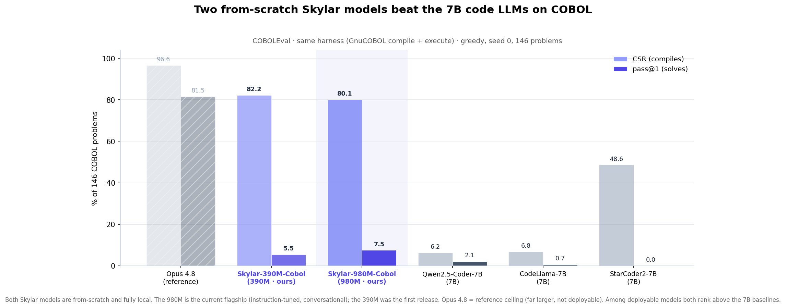

<div align="center">

```
 ███████╗██╗  ██╗██╗   ██╗██╗      █████╗ ██████╗
 ██╔════╝██║ ██╔╝╚██╗ ██╔╝██║     ██╔══██╗██╔══██╗
 ███████╗█████╔╝  ╚████╔╝ ██║     ███████║██████╔╝
 ╚════██║██╔═██╗   ╚██╔╝  ██║     ██╔══██║██╔══██╗
 ███████║██║  ██╗   ██║   ███████╗██║  ██║██║  ██║
 ╚══════╝╚═╝  ╚═╝   ╚═╝   ╚══════╝╚═╝  ╚═╝╚═╝  ╚═╝
```

### 🧠 A from-scratch LLM training framework — 6M to 128B parameters, one codebase.

[](https://python.org)
[](https://pytorch.org)
[](https://huggingface.co)
[](LICENSE)

<br>

*Built from first principles. No black boxes. Every layer, every rotation, every gradient — explicit.*

**by [A. Ivanovitch](https://www.linkedin.com/in/aleksandr-ivanovitch-brunelli) — CEO [MwSpace](https://mwspace.com)**

[🤗 Models](https://huggingface.co/collections/Sophia-AI/skylar) · [🌐 skyl4r.ai](https://skyl4r.ai)

---

</div>

<div align="center">

### ⌨️ Skylar writes COBOL — it compiles, runs, and returns the right answer. 100% local, 100% from scratch.


<sub>A from-scratch Skylar model completes a COBOL task → **GnuCOBOL compiles it** → it **runs** → correct output. No internet, no API, no third-party weights.</sub>



</div>

> **The COBOL specialist is live.** `pip install skylar`. On **COBOLEval** (GnuCOBOL compile + execute,
> same harness) the flagship **Skylar-980M-Cobol beats Qwen2.5-Coder-7B, CodeLlama-7B and StarCoder2-7B**
> on both compile-rate and pass@1 — at **~7× fewer parameters**, fully local and **from scratch**. Model +
> full numbers: **[Sophia-AI/Skylar-980M-Cobol](https://huggingface.co/Sophia-AI/Skylar-980M-Cobol)**
> *(research preview — a COBOL-only specialist, not a general chatbot; read the card).*

```bash
pip install skylar

# the COBOL specialist (Skylar-980M-Cobol) — writes, explains & modifies COBOL, 100% local
skylar chat --model Sophia-AI/Skylar-980M-Cobol --system "Sei un esperto programmatore COBOL."

# chat & semantic retrieval (Italian-legal, 236M)
skylar chat  --model Sophia-AI/Skylar-236M-Chat
skylar embed --model Sophia-AI/Skylar-236M-Embed --query "prestito casa" --docs "mutuo" "meteo"
```

<br>

> **Skylar** is a research-grade, production-ready decoder-only Transformer framework that implements the exact same
> architectural blueprint used by **LLaMA 3**, **Mistral**, and **Qwen3** — written entirely from scratch in PyTorch
> with
> zero abstraction layers. Every component is auditable, every parameter traceable, every design choice documented.

<br>

## ⚡ Quick Start

```bash
# ── Clone & install ──────────────────────────────────────
git clone https://github.com/skyl4r-ai/skylar.git && cd skylar
python -m venv .venv && source .venv/bin/activate
pip install -e .

# ── Train a model from scratch ───────────────────────────
python training/bin.pretrain.py --preset small --bf16

# ── Chat with your model ─────────────────────────────────
python inference/bin.chat.py --model checkpoints_sft/best
```

<br>

## 🏗️ Architecture at a Glance

```
┌─────────────────────────────────────────────────────────────┐
│                        SKYLAR v3.0                          │
├─────────────────────────────────────────────────────────────┤
│                                                             │
│  Input Tokens ──► Token Embedding ──► Dropout               │
│                        │                                    │
│                        ▼                                    │
│           ┌────────────────────────┐                        │
│           │   × L Transformer Blocks                        │
│           │  ┌──────────────────┐  │                        │
│           │  │ RMSNorm (Pre)    │  │                        │
│           │  │ GQA + RoPE + QKN │──┤◄── FlexAttention /     │
│           │  │ Residual Add     │  │    SDPA / Causal       │
│           │  ├──────────────────┤  │                        │
│           │  │ RMSNorm (Pre)    │  │                        │
│           │  │ SwiGLU FFN       │  │                        │
│           │  │ Residual Add     │  │                        │
│           │  └──────────────────┘  │                        │
│           └────────────────────────┘                        │
│                        │                                    │
│                        ▼                                    │
│              Final RMSNorm ──► LM Head ──► Logits           │
│                                    │                        │
│                              (optional µP                   │
│                               logit scaling)                │
│                                                             │
└─────────────────────────────────────────────────────────────┘
```

<br>

## 🔬 Core Components

| Component            | Implementation                        | Why                                        |
|:---------------------|:--------------------------------------|:-------------------------------------------|
| 🧊 **Normalization** | `RMSNorm` (pre-norm residual)         | Faster than LayerNorm, no mean computation |
| 🌀 **Positions**     | `RoPE` with configurable θ            | Relative encoding, natural extrapolation   |
| 🔗 **Attention**     | `GQA` + `QK-Norm` + explicit `d_head` | Qwen3-identical, reduced KV-cache          |
| ⚡ **FFN**            | `SwiGLU` (gate × swish × up)          | +1-2% over GELU at same FLOPs              |
| 🎭 **Masking**       | `FlexAttention` block-sparse          | O(T) memory for packed sequences           |
| 📐 **Scaling**       | `µP` (Maximal Update Param.)          | Tune on 50M → transfer to 4B+              |
| 💾 **KV-Cache**      | Full validation + GQA expansion       | O(1) per-step generation cost              |
| 🤗 **Interface**     | HuggingFace `PreTrainedModel`         | Native save/load/hub integration           |

<br>

## 📊 Model Family — 15 Presets, 5 Orders of Magnitude

```
  6M ──────────────────────────────────────────────────── 128B
  │                                                        │
 test  small  medium  medium+  gold  large  1B  4B  8B  14B  32B  64B  96B  128B
  │      │       │        │      │     │    │   │   │    │    │    │    │     │
 CPU  RTX4090 RTX4090 RTX4090 RTX4090 H100 H100 DGX DGX  DGX  DGX  DGX  DGX  DGX
```

<details>
<summary>📋 <strong>Full Preset Table</strong> — click to expand</summary>

<br>

|  Preset  |   Params   | d_model | Heads | KV Heads | d_head | Layers | d_ff  | Context | θ_rope | Qwen3 Match |
|:--------:|:----------:|:-------:|:-----:|:--------:|:------:|:------:|:-----:|:-------:|:------:|:-----------:|
|  `test`  |  **~6M**   |   128   |   4   |    4     |   32   |   4    |  256  |   4K    |  100K  |      —      |
| `small`  |  **~40M**  |   512   |   8   |    4     |   64   |   8    | 1024  |   8K    |  500K  |      —      |
| `small+` |  **~70M**  |   640   |  10   |    5     |   64   |   10   | 1792  |   16K   |   1M   |      —      |
| `medium` | **~107M**  |   768   |  12   |    4     |   64   |   12   | 2048  |   16K   |   1M   |      —      |
| `medium+`| **~236M**  |  1024   |  16   |    4     |   64   |   18   | 2816  |   16K   |   1M   |   ⭐ prod   |
| `large`  | **~358M**  |  1024   |  16   |    4     |   64   |   28   | 2816  |   16K   |   5M   |      —      |
| `gold`   | **~393M**  |  1280   |  10   |    2     |  128   |   20   | 3456  |   16K   |   1M   |      —      |
|   `1B`   | **~1.0B**  |  1536   |  16   |    4     |   96   |   32   | 5120  |   32K   |   5M   |      —      |
|   `4b`   | **~3.6B**  |  2560   |  32   |    8     |  128   |   36   | 9728  |   32K   |   1M   | ✅ Qwen3-4B  |
|   `8b`   | **~7.3B**  |  4096   |  32   |    8     |  128   |   36   | 12288 |   32K   |   1M   | ✅ Qwen3-8B  |
|  `14b`   | **~13.2B** |  5120   |  40   |    8     |  128   |   40   | 17408 |   32K   |   1M   | ✅ Qwen3-14B |
|  `32b`   | **~29.6B** |  5120   |  64   |    8     |  128   |   64   | 25600 |  128K   |   1M   | ✅ Qwen3-32B |
|  `64b`   |  **~61B**  |  8192   |  64   |    8     |  128   |   72   | 28672 |  128K   |   1M   |      —      |
|  `96b`   |  **~99B**  |  10240  |  80   |    8     |  128   |   80   | 32768 |  128K   |   1M   |      —      |
|  `128b`  | **~128B**  |  11264  |  88   |    8     |  128   |   92   | 32768 |  128K   |   1M   |      —      |

> 💡 The `4b` through `32b` presets are **architecturally identical** to Qwen3 official configs (verified against
> HuggingFace `config.json`). Only `vocab_size` differs (40,960 vs 151,936).

</details>

<br>

## 🔄 Training Pipeline — one base, many products

One pretrained decoder backbone feeds an entire post-training suite. All
discriminative/retrieval heads reuse the same weights via `from_decoder()` — **no
re-pretraining**.

```
                          ┌──────────────────────┐
                          │   📚 PRETRAIN (base)  │  causal LM on raw text
                          └───────────┬──────────┘
              ┌───────────────┬───────┴───────┬────────────────┐
              ▼               ▼               ▼                ▼
      ┌──────────────┐ ┌─────────────┐ ┌──────────────┐ ┌──────────────┐
      │ 💬 SFT (chat)│ │ 🔎 EMBEDDER │ │ 🧮 SPARSE    │ │ 🏷️ CLASSIFIER │
      │  ChatML      │ │  dense      │ │  SPLADE      │ │  BERT-style   │
      │  + ORPO/SimPO│ │ (InfoNCE)   │ │ (FLOPS reg)  │ │  (CE)         │
      └──────────────┘ └─────────────┘ └──────────────┘ └──────────────┘
        generative       dense vec       sparse vec       class logits
                          └────── hybrid retrieval ──────┘ (Qdrant)
```

| Stage | Script | Output |
|:--|:--|:--|
| **Pretrain** | `training/bin.pretrain.py` | causal-LM base |
| **SFT** | `training/bin.sft.py` | ChatML chat model (assistant-only loss) |
| **Preference** | `training/bin.preference.py` | ORPO / SimPO (reference-free, replaces DPO) |
| **Dense embedder** | `training/bin.contrastive.py` | `SkylarEmbedder` (InfoNCE) |
| **Sparse retriever** | `training/bin.sparse.py` | `SkylarSparseEncoder` (SPLADE) |
| **Classifier** | `training/bin.classify.py` | `SkylarClassifier` (sequence classification) |

See [`docs/POSTTRAIN.md`](docs/POSTTRAIN.md) for the full recipe.

<br>

## 📈 Validated Results — `medium_plus` (236M)

Trained from scratch on **1.12B tokens** of Italian legal/normative text (4 epochs, ~19h on a single
RTX 4090), then the full post-training suite. All four products come from the **same 236M weights**.

| Product | Metric |
|:--|:--|
| **Base LM** | val loss **2.16** · health-check perplexity **15.4** |
| **Chat (SFT)** | grounded tasks **6/6 correct** (answer-from-context, classify, extract-JSON, refuse-when-absent) · clean stop **6/6** grounded, **12/13** full battery |
| **Dense embedder** | SQuAD-it test R@1 **0.55** · nDCG@10 **0.71** (open-domain) · R@1 **0.93** in-domain |
| **Sparse (SPLADE)** | Recall@1 **1.000** · ~5 non-zeros/query · interpretable lexical weights (in-domain) |
| **Classifier** | intent accuracy **1.00** (5-way banking, held-out) |

**Public Italian generative benchmarks** (likelihood-based MC, `eval/bench_ita.py`):

| | medium (100M) | **medium_plus (236M)** | random |
|:--|:--:|:--:|:--:|
| XCOPA-it (causal commonsense) | 0.546 | **0.562** ⭐ | 0.50 |
| HellaSwag-it | 0.279 | 0.292 | 0.25 |
| Belebele-it | 0.244 | 0.267 | 0.25 |

**Retrieval vs off-the-shelf SOTA** — `eval/bench_retrieval.py`, SQuAD-it test (7609 queries / 1988 contexts,
identical pool & metrics for every model). The Skylar embedder is the 236M base + a cheap contrastive
fine-tune on Italian QA; bge-m3 and e5 are evaluated zero-shot:

| Model | Params | R@1 | R@5 | nDCG@10 |
|:--|:--:|:--:|:--:|:--:|
| Skylar-embed (IT-QA fine-tune) | **236M** | 0.55 | 0.81 | 0.71 |
| `intfloat/multilingual-e5-base` | 278M | 0.71 | 0.91 | 0.83 |
| `BAAI/bge-m3` | 568M | 0.70 | 0.90 | 0.83 |

> **Honest scope — what's real and declarable.** The 236M base is a **grounded Italian RAG model**, not a
> factual oracle: in its intended role it scores **6/6** (answer/extract/classify/refuse-from-context) with
> clean stopping, but it **hallucinates open-domain facts** and the knowledge-heavy benchmarks sit near random,
> as expected for the size. It is an **Italian specialist** — English generation is not fluent (Italian-only
> corpus). The from-scratch retriever reaches **~78% of the R@1 and ~86% of the nDCG** of `bge-m3` (which is
> **2.4× larger**) while running fully **local/offline** from the same base; it does **not** beat the
> multilingual SOTA on accuracy — its edge is **size, locality and a one-base gen+dense+sparse+classifier
> stack**. The retrieval gap traces to the narrow 1.12B-token pretrain, not the contrastive recipe.

### Stage 1 — Pre-Training

```bash
python training/bin.pretrain.py \
  --preset medium \
  --data .datasets/pretokenized \
  --bf16 \
  --batch_size 32 \
  --grad_accum 4 \
  --lr 3e-4 \
  --warmup_steps 2000
```

| Feature            | Detail                                                          |
|:-------------------|:----------------------------------------------------------------|
| 📦 **Data format** | Sharded uint32 `.bin` files (1GB each) with SHA256 checksums    |
| ☁️ **Storage**     | Local disk or AWS S3 (shards cached locally, then memory-mapped) |
| 📈 **Scheduler**   | WSD (Warmup-Stable-Decay) or cosine annealing                   |
| 💾 **Checkpoints** | HuggingFace format + async S3 upload via `ThreadPoolExecutor`   |
| 🔄 **Resume**      | Full state recovery (model, optimizer, scaler, step, best loss) |
| 🎛️ **µP**         | Train proxy at 50M, transfer HPs directly to 4B+                |

### Stage 2 — Supervised Fine-Tuning (SFT)

```bash
python training/bin.sft.py \
  --base_model checkpoints/final \
  --data sft_data.jsonl \
  --epochs 3 \
  --lr 2e-5
```

| Feature               | Detail                                                         |
|:----------------------|:---------------------------------------------------------------|
| 🏷️ **Format**        | ChatML (`<\|im_start\|>role\n...<\|im_end\|>`)                 |
| 🎯 **Loss masking**   | Gradient only on assistant tokens (system/user masked to -100) |
| 🔤 **Special tokens** | `<\|im_end\|>` loss boost for clean turn termination           |
| 📊 **Logging**        | W&B integration with per-step metrics                          |

<br>

## 🗂️ Project Structure

```
skylar/
├── 🧠 models/                     # Model architecture
│   ├── config.py                  #   NanoTransformerConfig + 15 presets
│   ├── decoder.py                 #   NanoTransformer (GPT decoder)
│   ├── embedder.py                #   SkylarEmbedder (bidirectional)
│   ├── heads.py                   #   Classification + Reward heads
│   └── layers/
│       ├── attention.py           #     GQA + RoPE + FlexAttention + KV-Cache
│       ├── block.py               #     TransformerBlock (pre-norm residual)
│       ├── ffn.py                 #     SwiGLU FFN
│       ├── norm.py                #     RMSNorm
│       ├── rope.py                #     Rotary Position Embeddings
│       └── kv_cache.py            #     KV-cache utilities
│
├── 📦 data/                       # Data pipeline
│   ├── bin.tokenizer.py           #   BPE tokenizer training + sharding
│   ├── memmap_dataset.py          #   MemmapTokenDataset + Prefetcher (streaming loader)
│   ├── bin.sft_data_to_jsonl.py   #   SFT data converter
│   ├── bin.sft_data_shaffle.py    #   Shuffle utility
│   ├── bin.sft_synthetic_data.py  #   Agentic synthetic data generator
│   └── pretrain-pipeline/         #   Pre-training corpus builder
│       ├── bin.pretrain_builder.py #     CLI: extract → clean → filter → dedup → shuffle
│       ├── extractors.py          #     PDF (Docling GPU) / HTML / JSON / TXT / XML
│       ├── cleaners.py            #     MinimalNormalizer, ColumnMergeCleaner
│       ├── prose_filter.py        #     Heuristic + GPU perplexity scoring
│       └── pipeline.py            #     PII (Presidio NER), Quality, Spam, Dedup
│
├── 🏋️ training/                    # Training loops
│   ├── bin.pretrain.py            #   Pre-training (Stage 1)
│   ├── bin.sft.py                 #   SFT (Stage 2)
│   ├── bin.preference.py          #   Preference opt — ORPO/SimPO (Stage 3)
│   ├── bin.distill.py             #   Knowledge distillation (online logit KD)
│   └── bin.dpo.py                 #   DPO signpost → see bin.preference.py
│
├── 📊 eval/                       # Evaluation & diagnostics
│   ├── bin.eval_base_model.py     #   Base model eval
│   ├── bin.eval_sft_model_*.py    #   SFT model eval
│   └── bin.diagnose_sft*.py       #   SFT debugging tools
│
├── 💬 inference/                   # Generation & chat
│   ├── bin.chat.py                #   Interactive streaming REPL
│   ├── bin.generate.py            #   Text generation
│   └── bin.embed.py               #   Embedding extraction (SkylarEmbedder)
│
├── 🛠️ utils/                      # Utilities
│   ├── chatML.py                  #   ChatML encoding + loss mask
│   └── bin.download_aws_*.py      #   S3 checkpoint download
│
└── 📄 docs/                       # Documentation
    ├── PAPER.md                   #   Technical paper (Skylar v3.0)
    └── GUIDE.md                   #   Training guide
```

<br>

## 🎙️ Interactive Chat

Skylar ships with a **rich terminal chat interface** powered by the `rich` library:

```bash
python inference/bin.chat.py --model checkpoints_sft/best
```

```
╭─────────────────── 🧠 Skylar Chat ───────────────────╮
│  Model: checkpoints_sft/best                          │
│  Params: 107M │ Context: 16K │ Device: cuda           │
╰───────────────────────────────────────────────────────╯

 You ► Spiegami cos'è il RoPE in modo semplice

 Skylar ► Il RoPE (Rotary Position Embeddings) è un modo
 elegante per dire al modello "dove" si trova ogni parola
 nella frase. Invece di aggiungere numeri alla posizione,
 ruota i vettori nello spazio...
```

| Command           | Description           |
|:------------------|:----------------------|
| `/system <msg>`   | Set system prompt     |
| `/temp <0.0-2.0>` | Adjust temperature    |
| `/topk <n>`       | Set top-k sampling    |
| `/topp <0.0-1.0>` | Set nucleus sampling  |
| `/rep <1.0-2.0>`  | Repetition penalty    |
| `/max <n>`        | Max generation tokens |
| `/clear`          | Clear conversation    |
| `/config`         | Show current config   |
| `/help`           | Show all commands     |
| `/quit`           | Exit                  |

<br>

## 🔬 What Makes Skylar Different

<table>
<tr>
<td width="50%">

### 🎯 Transparent by Design

Every component — RMSNorm math, RoPE frequency tables, GQA head expansion, FlexAttention mask functions, µP scaling
rules — is a standalone, readable PyTorch module. No library-level black boxes.

</td>
<td width="50%">

### 🧬 Qwen3 Architectural Parity

The 4B–32B presets are **byte-for-byte identical** to Qwen3's published architectures. Techniques developed here
transfer directly to/from the Qwen3 family.

</td>
</tr>
<tr>
<td>

### ⚡ Three-Path Attention Dispatch

The attention layer auto-selects the optimal path:

1. **FlexAttention** + block mask (PyTorch ≥ 2.5)
2. **SDPA** + dense mask (fallback)
3. **Causal SDPA** with `is_causal=True` (generation)

</td>
<td>

### 📐 µP — Tune Small, Scale Big

Full Maximal Update Parameterization: width-scaled init, per-group LR, 1/d_head attention scaling, output logit scaling.
Tune HPs on ~50M params, transfer to 4B+ for free.

</td>
</tr>
<tr>
<td>

### 🤖 Agentic Data Synthesis

Multi-agent pipeline: **Analyst → Turn Builder → Validator → Dedup → Shuffle**. Supports OpenAI, Anthropic, and
self-hosted vLLM endpoints as teacher models.

</td>
<td>

### 🌍 Italian-specialist

Configurable ByteLevel BPE (the released `medium_plus` uses a **32,768** vocab trained on Italian
legal/normative text). Special tokens for chat (`<|im_start|>`, `<|im_end|>`), thinking (`<think>`), and tool use
(`<tool_call>`). The vocabulary supports English byte-level, but a model trained on an Italian-only corpus is an
**Italian specialist** — English generation is not fluent unless English data is added to pretraining.

</td>
</tr>
</table>

<br>

## 🖥️ Hardware Requirements

|  Preset  |     VRAM     |    Device     | Throughput  | Time for Chinchilla |
|:--------:|:------------:|:-------------:|:-----------:|:-------------------:|
|  `test`  |    <1 GB     | CPU / any GPU |      —      |       minutes       |
| `small`  |    ~2 GB     |   RTX 4090    | ~100K tok/s |     ~5 hours ✅      |
| `medium` |    ~6 GB     |   RTX 4090    | ~51K tok/s  |     ~10 hours ✅     |
| `large`  |    ~12 GB    |   RTX 4090    | ~19K tok/s  |       ~4 days       |
|   `1B`   |    ~48 GB    | RTX PRO 6000  | ~12K tok/s  |      ~19 days       |
|   `4b`   |    ~96 GB    | RTX PRO 6000  | ~3.5K tok/s |      ~9 months      |
|   `4b`   | 5× DGX H100  |    40 GPUs    | ~240K tok/s |       ~8 days       |
|   `8b`   | 5× DGX H100  |    40 GPUs    | ~170K tok/s |      ~20 days       |
|  `14b`   | 10× DGX H100 |    80 GPUs    | ~150K tok/s |      ~44 days       |
|  `32b`   | 10× DGX H100 |    80 GPUs    | ~55K tok/s  |      ~9 months      |
|  `128b`  |  512× H100   |    cluster    | ~40K tok/s  |     ~24 months      |

> ✅ = measured benchmarks on actual hardware

<br>

## 🔧 Configuration

```python
from models.config import get_config, NanoTransformerConfig

# Use a preset
config = get_config("medium")

# Customize
config = get_config("medium", vocab_size=40960, dropout=0.05, max_seq_len=32768)

# Full manual config
config = NanoTransformerConfig(
    vocab_size=40960,
    d_model=768,
    n_heads=12,
    n_kv_heads=4,
    n_layers=12,
    d_ff=2048,
    max_seq_len=16384,
    qk_norm=True,
    rope_theta=1_000_000.0,
    mup_base_d_model=256,  # enable µP with 256-width proxy
)
```

<br>

## 🗃️ Tokenizer

```bash
python data/bin.tokenizer.py \
  --data corpus/ \
  --vocab_size 40960 \
  --output .datasets/tokenizer
```

| Feature       | Detail                                                |
|:--------------|:------------------------------------------------------|
| **Algorithm** | ByteLevel BPE (HuggingFace `tokenizers`, Rust-backed) |
| **Vocab**     | configurable (default 40,960; `medium_plus` uses 32,768) |
| **Output**    | Sharded uint32 `.bin` files (1GB each)                |
| **Checksums** | SHA256 per shard + JSON metadata                      |
| **Upload**    | Opt-in S3 multipart upload (via `--s3_bucket`)        |

**Special tokens:**


```
<pad>  <bos>  <eos>  <|im_start|>  <|im_end|>
<think>  </think>  <tool_call>  </tool_call>
<tool_response>  </tool_response>
```

<br>

## 🛡️ Pre-Training Data Pipeline

The `data/pretrain-pipeline/` module transforms raw documents (PDF, HTML, JSON, TXT) into a clean, shuffled, deduplicated corpus ready for tokenization. Built for **Italian legal/institutional text** (EUR-Lex, Gazzetta Ufficiale, Banca d'Italia).

```bash
python data/pretrain-pipeline/bin.pretrain_builder.py /path/to/raw_documents \
  -o .datasets/pretokenized \
  --max-gb 5 \
  --gpu-perplexity
```

```
 Raw files (PDF/HTML/JSON/TXT)
      │
      ├──── TXT (chat templates) ──── bypass all filters ──┐
      │     Curated ChatML data included as-is to teach     │
      │     the model <|im_start|>/<|im_end|> structure     │
      │     from the earliest pre-training steps.           │
      │                                                     │
      ▼                                                     │
 1. Extraction        Docling (GPU) / trafilatura / JSON    │
      │                                                     │
      ▼                                                     │
 2. Normalization     MinimalNormalizer — ftfy, NFKC         │
      │                                                     │
      ▼                                                     │
 3. Column Merge      Broken two-column PDF detection        │
      │                                                     │
      ▼                                                     │
 4. Prose Filter      Semantic chunking + scoring + PPL      │
      │                                                     │
      ▼                                                     │
 5. PII Redaction     Presidio NER (Italian)                 │
      │                 Names → <PERSONA>                    │
      │                 Email → <EMAIL>  Phone → <TELEFONO>  │
      │                 CF → <CF>  IBAN → <IBAN>  CC → <CC>  │
      │                                                     │
      ▼                                                     │
 6. Quality + Spam + Dedup                                   │
      │                                                     │
      ▼                                                     ▼
 7. Shuffle + Write   Global shuffle → <bos>doc<eos> output chunks
```

| Component       | Technology                          | Purpose                            |
|:----------------|:------------------------------------|:-----------------------------------|
| PDF Extraction  | Docling (GPU) + pymupdf fallback    | Layout-aware reading order         |
| PII Detection   | Microsoft Presidio + spaCy NER      | Context-aware PII redaction        |
| Perplexity      | `facebook/xglm-564M` (optional GPU) | Filter incoherent / repetitive text |
| Near-Dedup      | MinHash LSH (datasketch)            | Fuzzy duplicate removal            |

<br>

## 🤗 HuggingFace Integration

Despite being built from scratch, Skylar is fully HuggingFace-native:

```python
from models.decoder import NanoTransformer

# Save
model.save_pretrained("my-skylar-model")

# Load
model = NanoTransformer.from_pretrained("my-skylar-model")

# Push to Hub (native, inherited from PreTrainedModel — the model family is live on the Hub)
model.push_to_hub("Sophia-AI/skylar-medium")
```

<br>

## ☁️ Remote Training

Train on any remote GPU box (RunPod, Lambda, a bare server) by SSHing in and running the same
commands as above — the pipeline has no host-specific dependencies. Manage the instance with your
provider's CLI (e.g. `runpodctl`), and pull checkpoints back with `utils/bin.download_aws_checkpoint.py`
(opt-in S3 via `--s3_bucket`).

<br>

## 🗺️ Roadmap

- [x] 🧠 Full decoder-only Transformer architecture
- [x] 🌀 RoPE + GQA + QK-Norm + SwiGLU
- [x] ⚡ FlexAttention document masking
- [x] 📐 µP (Maximal Update Parameterization)
- [x] 📚 Pre-training pipeline with packed sequences
- [x] 🛡️ Pre-training corpus builder (Docling + Presidio PII + dedup)
- [x] 💬 SFT with ChatML + loss masking
- [x] 🎙️ Interactive streaming chat REPL
- [x] 🤖 Agentic synthetic data generation
- [x] 🔍 SkylarEmbedder (bidirectional dense retrieval)
- [x] 🔗 Contrastive training for the embedder (InfoNCE)
- [x] 🧮 Sparse retrieval — SkylarSparseEncoder (SPLADE-style)
- [x] 🏷️ SkylarClassifier (BERT-style sequence classification)
- [x] 🎯 Preference optimization — ORPO / SimPO (reference-free; supersedes DPO)
- [x] 🧪 Public Italian benchmarks (XCOPA / HellaSwag / Belebele)
- [x] 📊 Evaluation & diagnostic tools
- [x] 🌊 Streaming/memmap dataset — `MemmapTokenDataset` + prefetch (long-run pretrain trainer)
- [x] 🧪 Knowledge distillation trainer — online logit KD (full + decoupled Top-K)
- [x] ⌨️ COBOL code specialist — from-scratch, COBOLEval-validated ([Skylar-980M-Cobol](https://huggingface.co/Sophia-AI/Skylar-980M-Cobol))
- [x] 📦 Push-to-Hub — native via `PreTrainedModel`; model family live on the Hub
- [x] 🌐 OpenAI-compatible inference server — ships in the [`skylar`](https://pypi.org/project/skylar/) pip package
- [ ] 🔭 Long-context: sliding-window attention + YaRN (for 8K+)
- [ ] 🎯 Classic DPO (optional; `bin.preference.py` covers the reference-free variants)

<br>

## 📚 Documentation

| Document                                         | Description                                     |
|:-------------------------------------------------|:------------------------------------------------|
| [`docs/PAPER.md`](docs/PAPER.md)                 | Full technical paper — Skylar v3.0 architecture |
| [`docs/RESULTS.md`](docs/RESULTS.md)             | **Validated results** — public benchmarks + retrieval vs bge-m3 / e5 |
| [`docs/POSTTRAIN.md`](docs/POSTTRAIN.md)         | Post-training suite — chat, embeddings, sparse, classifier |
| [`docs/GUIDE.md`](docs/GUIDE.md)                 | Step-by-step training guide                     |
| [`docs/STRUCTURE.md`](docs/STRUCTURE.md)       | Codebase structure reference                    |
| [`docs/DISTILLATION.md`](docs/DISTILLATION.md) | Synthetic data distillation guide               |
| [`docs/TRAINING_SET.md`](docs/TRAINING_SET.md) | Dataset preparation reference                   |

<br>

## 📄 Tech Stack

```
┌──────────────────────────────────────────────────┐
│  🐍 Python 3.10+                                 │
├──────────────────────────────────────────────────┤
│  🔥 PyTorch ≥ 2.1      │  Core ML engine         │
│  🤗 Transformers       │  HF compatibility layer │
│  🔤 Tokenizers         │  Rust-backed BPE        │
│  🚀 Accelerate         │  Multi-GPU (DDP/FSDP)   │
│  📊 W&B                 │  Experiment tracking   │
│  ☁️  Boto3             │  AWS S3 storage         │
│  🤖 OpenAI + Anthropic │  Teacher model APIs     │
│  🛡️  Presidio + spaCy │  PII detection (NER)    │
│  📄 Docling            │  GPU PDF extraction     │
│  📋 Pydantic           │  Data validation        │
│  🎨 Rich               │  Terminal UI            │
│  ⚙️  Typer             │  CLI framework          │
└──────────────────────────────────────────────────┘
```

<br>

## 📜 License

Skylar is licensed under the **[Apache License 2.0](LICENSE)**.

Copyright © 2026 **Aleksandr Ivanovitch**, who holds all intellectual property
rights in this software.
See the [`LICENSE`](LICENSE) and [`NOTICE`](NOTICE) files
for the full terms and attribution.

You are free to use, modify, and distribute this software under the terms of the
Apache 2.0 license, provided you retain the copyright, patent, trademark, and
attribution notices.

<br>

---

<div align="center">

```
┌─────────────────────────────────────────────────────────────────┐
│                                                                 │
│  "The best way to understand a Transformer is to build one."    │
│                                                                 │
│                              — Skylar Project Philosophy        │
│                                                                 │
└─────────────────────────────────────────────────────────────────┘
```

**Built with 🔥 by [Aleksandr Ivanovitch](https://www.linkedin.com/in/aleksandr-ivanovitch-brunelli)**

*Making frontier AI transparent, auditable, and reproducible.*

<sub>Copyright © 2026 Aleksandr Ivanovitch · Licensed under the Apache License 2.0.</sub>

</div>
