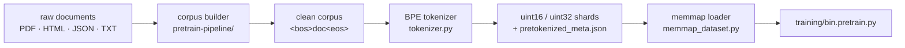
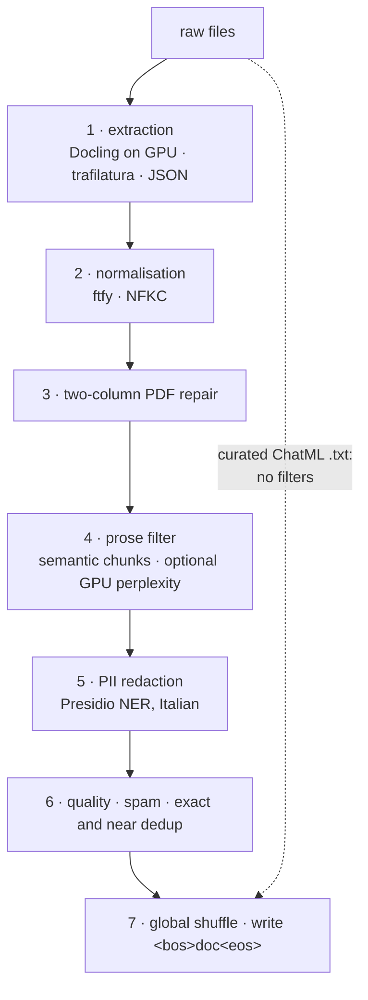

# `data/` · from raw documents to token shards



## Tokenizer

Two entry points share the same special tokens:

- [`tokenizer.py`](tokenizer.py) is the library: a code-aware ByteLevel BPE, with digits split one by one
  and uint16 shards whenever the vocabulary fits, which halves memory and disk.
- [`bin.tokenizer.py`](bin.tokenizer.py) is the command-line recipe used for the Italian-legal models:
  uint32 shards and optional S3 upload.

```python
from pathlib import Path
from data.tokenizer import train, tokenize_to_shards

tok = train(48128, docs, Path("tokenizer.json"))
records, total, n = tokenize_to_shards(tok, docs, out_dir)   # <bos> + ids + <eos> per document
```

```bash
python data/bin.tokenizer.py --data corpus/ --output .datasets/tokenized --vocab_size 40960
```

**Special tokens:** `<pad>` `<bos>` `<eos>` `<|im_start|>` `<|im_end|>` `<think>` `</think>`
`<tool_call>` `</tool_call>` `<tool_response>` `</tool_response>`.

## Shard format

A tokenized directory holds `tokenizer.json`, `pretokenized_meta.json` (with the `dtype`) and
`shards/shard_000000.bin …`: little-endian uint16 or uint32, documents packed back to back as
`<bos> … <eos>`. `bin.tokenizer.py` also writes a SHA-256 checksum per shard.

[`memmap_dataset.py`](memmap_dataset.py) reads them without loading the corpus into memory:

```python
from data.memmap_dataset import MemmapTokenDataset, Prefetcher
ds = MemmapTokenDataset("data/tokenized", seq_len=2048)
x, y = ds.get_batch_at("train", 16, batch_index=0, device="cuda")   # shuffled pass, no repeats
pf = Prefetcher(ds, "train", 16, "cuda", seed=1234, indexed=True)   # loads while the GPU computes
```

Windows cross document boundaries on purpose. When attention, or a recurrent state, must not cross them,
the loader returns per-position document ids for the mask.

## Corpus builder

[`pretrain-pipeline/`](pretrain-pipeline/) turns raw documents into a clean, deduplicated, shuffled corpus.
It was built for Italian legal and institutional text: EUR-Lex, Gazzetta Ufficiale, Banca d'Italia.

```bash
python data/pretrain-pipeline/bin.pretrain_builder.py /path/to/raw_documents -o .datasets/pretokenized --max-gb 5
```



| step | technology | purpose |
|:--|:--|:--|
| PDF extraction | Docling (GPU), pymupdf fallback | layout-aware reading order |
| PII redaction | Microsoft Presidio + spaCy | names → `<PERSONA>`, and `<EMAIL>`, `<TELEFONO>`, `<CF>`, `<IBAN>`, `<CC>` |
| perplexity | `facebook/xglm-564M`, optional (`--no-gpu-perplexity` to skip) | drops incoherent or repetitive text |
| near-dedup | MinHash LSH at 0.80 (datasketch) | removes fuzzy duplicates |

- **Curated ChatML `.txt` files bypass every filter**, so the model sees `<|im_start|>` / `<|im_end|>`
  from the first steps.
- **Consequence:** these files are neither redacted nor deduplicated. Only put text there that is
  already clean.

## Other tools

| file | what it does |
|:--|:--|
| [`bin.sft_synthetic_data.py`](bin.sft_synthetic_data.py) | synthetic conversations: analyst → turn builder → validator, with OpenAI, Anthropic or vLLM as teacher |
| [`bin.sft_data_to_jsonl.py`](bin.sft_data_to_jsonl.py), [`bin.sft_data_shaffle.py`](bin.sft_data_shaffle.py) | build and shuffle SFT JSONL |
| `gen_*.py` | small generators for the post-training suite: grounded SFT, preference pairs, contrastive pairs, classification, SQuAD-it retrieval |
| [`ted-processor/`](ted-processor/) | downloads and parses TED Europa tenders, 1993 to 2026, into an Italian corpus |
| [`bin.shard_dgt_data.py`](bin.shard_dgt_data.py) | splits one very large legal text file into shards |
