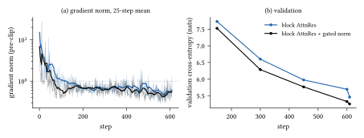

# Skylar 2: A Hybrid Recurrent–Attention Decoder for COBOL-Specialised Code Models

**Authors:** A. Ivanovitch
**Affiliation:** skyl4r.ai
**Date:** September 2026

## Abstract

Skylar 2 is a decoder for small, locally deployable code models whose first target is COBOL. It
interleaves Kimi Delta Attention with full attention at a 3:1 ratio, sized at parameter parity; replaces
the residual stream with block Attention Residuals, computed by a fused kernel into which the
pre-normalisation is folded; gates each normalisation with a low-rank sigmoid; and trains the hidden
linear maps with Muon. Each component was selected by paired three-seed ablations on a 146M-parameter
proxy with the depth and layer layout of the 990M target, trained on 30M tokens of our pre-training
corpus. Block aggregation lowers the validation cross-entropy by 0.078 nats, gated normalisation by a
further 0.232 and Muon by a further 0.292, in every seed; bits per byte fall by 23% overall and by 31% on
real COBOL. A sliding-window form of depth aggregation that improves on the baseline at 12 layers does
not train at 36, where the embedding leaves its window and the gradient norm at initialisation grows
ninefold. Against a dense Transformer with the same components the hybrid does not win on training
compute at this scale, being slightly ahead at equal tokens and slightly behind at equal time; at 32,768
tokens, however, it keeps a 3.9 times smaller cache per sequence, and with several long prompts it
generates 1.9 times as many tokens per second. All measurements are at small scale; no Skylar 2 model
has yet been trained at the target size.

## 1. Introduction

Skylar is a from-scratch decoder-only training framework whose current target is a small, locally
deployable specialist for COBOL, the language of a large share of legacy banking, insurance and
public-administration software. All Skylar models are trained from random initialisation; no
third-party weights are used. Our first specialist, a 980M-parameter dense Transformer trained on 20B
tokens, reaches an 80.1% compile-success rate on COBOLEval but a pass@1 of 7.5%, and every
post-training variant we tried lowered the benchmark further, which we read as a capacity limit
[1].

Skylar 2 is the architecture of the next generation. It is built around two requirements. The first
is long context: a COBOL program is not self-contained but comes with its copybooks, its job-control
language and its record layouts, and a model that cannot read them together cannot express the task.
This motivates a hybrid of recurrent and attention layers, whose cost per token does not grow with the
context in most layers. The second is capacity per parameter: the model has to fit on local hardware,
so improvements have to come from the architecture rather than from size.

This report describes the architecture and the experiments that selected its components. Every choice
is backed either by a published source or by a paired three-seed comparison on a proxy model with the
depth and layer layout of the first target model (36 layers, 990M parameters), trained on a uniform
sample of our own pre-training corpus. Two recent sources shaped the design: the ablations of
Attention Residuals by their authors [2] and the design report of the Qwen3.8-Next architecture
[3], which evaluates a closely related hybrid together with residual, normalisation and optimiser
variants.

**Findings.**

1. *Depth aggregation.* Block Attention Residuals improve on the plain residual stream in every seed.
   A sliding-window variant of the same mechanism improves on it at 12 layers but does not train at 36:
   the token embedding leaves its window and the gradient norm at initialisation grows ninefold. An
   ablation run at a third of the target depth would have selected it.
2. *Gated normalisation* [4] adds a further, larger improvement and shortens the tail of the
   gradient norm at an elevated learning rate.
3. *Muon* [5, 6] adds a further improvement over AdamW at each optimiser's best learning
   rate, and is insensitive to a fourfold change of learning rate.
4. *SiTU-GLU and SwiGLU* are indistinguishable; we keep the bounded SiTU-GLU.
5. *Hybrid against dense.* With the same components and optimiser, a dense Transformer is
   statistically indistinguishable from the hybrid at equal tokens (bits per byte favour the hybrid by
   1.6% in every seed) and slightly ahead at equal training time on an RTX 4090 at 8,192 tokens, where
   its step is 1.24× faster. The hybrid keeps a 3.9 times smaller cache per sequence at 32,768
   tokens and, with several long prompts, generates 1.9 times as many tokens per second: it is chosen
   for inference over long inputs, not for training cost.
6. *Cost.* With the pre-normalisation folded into a fused kernel, block aggregation makes the 990M
   training step 7% faster than no aggregation. Gated normalisation adds 4% to the step, and the
   Muon update 0.4%.

**Contributions.** A hybrid architecture sized at parameter parity; an implementation of block
Attention Residuals on the fused kernel of `flash-linear-attention` [7], with the pre-normalisation
folded in and gradient checkpointing kept exact; a controlled ablation at matched depth with paired
seeds and fixed evaluation windows; a set of correctness checks for this class of change; and a
depth-dependence result for depth aggregation that argues for running architectural ablations at the
target depth.

## 2. Related Work

**Linear attention and the delta rule.** Linear attention can be read as a fast-weight memory
[8]; the delta rule replaces additive writes by error-correcting ones [9]. Gated
DeltaNet adds a scalar per-head decay [10]; Kimi Delta Attention (KDA) generalises it to a
per-channel decay and is the recurrent layer of Kimi Linear [11]. Hybrids that interleave such
layers with full attention at a 3:1 ratio are used by Kimi Linear [11] and by the Qwen3-Next
line; in [3] a Gated-DeltaNet hybrid of this kind improves on a full-attention Transformer on
eight of nine benchmarks at 25B-A3B scale.

**Residual-stream variants.** Hyper-Connections widen the residual stream into several branches with
learned read, write and mixing operators [12]; mHC constrains the mixing operator to doubly stochastic
matrices [13]. Attention Residuals (AttnRes) replace the fixed residual sum with softmax attention
over earlier layer outputs, with a full form (all outputs) and a block form (the embedding plus one
summed representation per block of layers) [2]. The Gated Residual of [3] widens the stream
to four branches and reads it through an elementwise gate; in its comparison, full AttnRes matches it
in loss (1.762 against 1.762) and full AttnRes with gated normalisation improves on it (1.758)
[3, Table 6].

**Gating and normalisation.** Gated attention applies a sigmoid gate to the attention output and
removes the attention sink [14]. Gated normalisation applies a low-rank sigmoid gate after
RMSNorm, motivated by an analysis in which unbounded activation outliers act as the network's
rescaling mechanism; an explicit gate supplies that rescaling directly [4]. QK-normalisation
bounds attention logits [15].

**Optimisers and stability.** Muon orthogonalises the momentum of matrix parameters by Newton–Schulz
iterations [5]; with an update scaled to the root-mean-square of AdamW it can reuse AdamW learning
rates and has been reported to be about twice as compute-efficient [6]. A systematic
comparison with tuned baselines finds speed-ups of 1.4× at 0.1B parameters falling to 1.1× at 1.2B
[16]. Training instabilities of large models can be reproduced at small scale by raising the
learning rate [17]; [3] uses this protocol with the learning rate held constant.

## 3. Architecture

### 3.1 Base decoder

The base decoder follows the Qwen3 line: pre-normalisation with RMSNorm [18], rotary position
embeddings [19], grouped-query attention [20] with QK-normalisation [15], and a gated linear
unit in the feed-forward block [21]; input and output embeddings are tied below 8B parameters. The
990M configuration (`1B_D`) has width 1536, 36 layers, 12 query and 4 key-value heads of dimension
128, feed-forward width 4096 and a vocabulary of 64,000 tokens, for 1,004,395,008 parameters. With
every Skylar 2 option disabled, the model is bitwise identical to this decoder.

### 3.2 Token mixing

27 of the 36 layers replace attention by KDA [11], whose matrix state $S_t$ is updated by the
gated delta rule

$$S_t = \left(I - \beta_t k_t k_t^{\top}\right)\mathrm{Diag}(\alpha_t)\,S_{t-1} + \beta_t k_t v_t^{\top}$$ {#eq:kda}

with a per-channel decay $\alpha_t$ and a write strength $\beta_t$. Every fourth layer, including the
last, keeps full attention, which retains exact token-level retrieval: a `PIC` clause declared in
WORKING-STORAGE constrains a `MOVE` hundreds of lines later, verbatim.

**Parameter parity.** KDA has no grouped-query compression: its query, key, value and output
projections are all of size $d \times d_k$. Adopting the head count of the source architecture
therefore inflates the model, by 15.95% at 990M parameters. Equating the parameter cost of the two
layer types, $2\,d\,d_h\,(H + H_{\mathrm{kv}})$ for attention and $4\,d\,d_h\,H_{\mathrm{kda}}$ for KDA,
gives

$$H_{\mathrm{kda}} = \frac{H + H_{\mathrm{kv}}}{2}$$ {#eq:parity}

which is an integer for every preset of the family:

Table: Parameter-parity sizing of the recurrent layers (vocabulary 64,000). The residual cost comes from the short convolutions, the write-strength projection and the low-rank decay and output gates, which scale with $d$ rather than $d^2$.

| preset | heads | $H_{\mathrm{kda}}$ | key width | attention / layer | KDA / layer | model Δ | state / sequence |
|---|---|---:|---:|---:|---:|---:|---:|
| 990M | 12 / 4 | 8 | 1024 | 6.29M | 6.97M | +1.83% | 512 KB |
| 2B | 16 / 4 | 10 | 1280 | 10.49M | 11.37M | +1.15% | 640 KB |
| 4B | 32 / 8 | 20 | 2560 | 26.21M | 27.61M | +0.99% | 1280 KB |

The hybrid has 1,022,972,376 parameters at 990M (+1.85% over the base decoder, including the output
gate of §3.5). The recurrent state is the layer's associative memory, and it is finite: the nine
attention layers are load-bearing, not a compatibility detail.

### 3.3 Depth aggregation

In a pre-normalised Transformer, the input to each sub-layer is the sum of the embedding and all
earlier sub-layer outputs. AttnRes [2] replaces this sum by a softmax-weighted combination of a
set of sources $\{v_i\}$, with one learned pseudo-query $q$ per application point:

$$h = \sum_{i} \frac{\exp\left(q^{\top}\mathrm{RMSNorm}(v_i)\right)}{\sum_{j}\exp\left(q^{\top}\mathrm{RMSNorm}(v_j)\right)}\,v_i$$ {#eq:attnres}

There are two application points per layer (before token mixing and before the feed-forward block)
and one before the output head. Three variants differ only in the set of sources. Let $y_0$ be the
token embedding and $y_1, \dots, y_n$ the sub-layer outputs produced so far:

- **full**: the sources are $y_0, y_1, \dots, y_n$;
- **block**: the sub-layers are grouped into blocks of $S$ consecutive sub-layers; the sources are
  $y_0$, the sum $b_k$ of the outputs of every completed block $\mathcal{B}_k$, and the partial sum of
  the current block [2];
- **window**: the $W$ most recent outputs $\{y_{n-W+1}, \dots, y_n\}$.

Skylar 2 uses the block form with blocks of 8 sub-layers, which gives at most eleven sources on 36
layers (the embedding, nine completed blocks and one partial sum). The pseudo-queries are initialised
to zero, so that aggregation starts as a uniform average of the available sources. Every variant costs
$2d$ parameters per application point; the first point has a single source and no parameters, so the
990M model carries 72 points and 221,184 parameters.

### 3.4 Gated normalisation

Each pre-normalisation (before token mixing, before the feed-forward block, and before the output
head) is followed by a low-rank sigmoid gate computed from its own output [4]:

$$y = \mathrm{RMSNorm}(x), \qquad y' = y \odot \sigma\left(W_{\mathrm{up}}\,\mathrm{SiLU}(W_{\mathrm{down}}\,y)\right)$$ {#eq:gn}

with $W_{\mathrm{down}} \in \mathbb{R}^{r \times d}$ and $W_{\mathrm{up}} \in \mathbb{R}^{d \times r}$. We use $r = 16$ as in
[4], which costs $(2L+1) \cdot 2dr$ parameters: 3,588,096 at the 990M width (+0.35%). With
block AttnRes, the RMSNorm is folded into the fused aggregation kernel (§4.2) and only the gate is
applied to its output.

### 3.5 Attention output gate

The nine attention layers carry a sigmoid gate on the attention output, computed from the layer input
[14]. The gate can hold one value per channel or one per head; the two differ by 127× in
parameters at 990M (2,359,424 against 18,560 per layer). In an earlier five-seed comparison at 112M
parameters (12 layers, 600 steps and 4.9M tokens on a 10.8M-token corpus of real COBOL) the two were statistically
indistinguishable (validation cross-entropy 1.5732 against 1.5681, paired *t* = 0.61 on four degrees
of freedom, sign changing across seeds), and we use the per-head form. The recurrent layers have
their own output gate as part of KDA.

### 3.6 Feed-forward activation

The feed-forward block uses SiTU-GLU [22], a variant of SwiGLU in which both factors are soft-clipped:

$$\mathrm{SiTU}(x) = \beta_1 \tanh\left(\frac{W_1 x}{\beta_1}\right) \odot \sigma(W_1 x) \odot \beta_2 \tanh\left(\frac{W_3 x}{\beta_2}\right)$$ {#eq:situ}

For small activations it coincides with SwiGLU; for large ones its output is bounded by
$\beta_1 \beta_2 = 100$, a precondition for low-precision inference without retraining. The constants
$\beta_1 = 4$, $\beta_2 = 25$ are those of [22] and have not been tuned for our widths. §6.4 compares it
with SwiGLU.

### 3.7 Positional encoding and multi-token prediction

Rotary embeddings are kept on the attention layers. Removing them (NoPE) would let the recurrence
supply position, but our loader starts training windows at arbitrary offsets inside documents, so the
recurrent layers would learn position from states that begin mid-program, and a model trained without
rotary embeddings cannot receive them afterwards. [3] reports an independent reason: with NoPE,
a substantially higher rate of endless generation after post-training, which is not visible in
pre-training loss.

Multi-token prediction [23] was implemented and measured in the same earlier 112M setting: the best
validation cross-entropy of the principal head was identical to four decimal places, at 11% lower
throughput and 1.2 GiB more memory. It is not part of Skylar 2; the code remains behind a
default-off option.

## 4. Implementation

### 4.1 A reference implementation in PyTorch

For CPU execution and as a test reference, AttnRes is implemented in PyTorch without materialising
normalised copies of the sources: each score is computed from two reductions over the width,
$q^{\top}\mathrm{RMSNorm}(v) = v^{\top}(w \odot q)\,(\overline{v^2} + \varepsilon)^{-1/2}$, and the weighted sum
is accumulated source by source. The window variant, which we evaluate but do not adopt, is
implemented with $\mathrm{rms}(v) + \varepsilon$ in place of $(\overline{v^2} + \varepsilon)^{1/2}$; with
zero-initialised pseudo-queries both forms give uniform weights at initialisation, where the failure
analysed in §6.3 originates.

### 4.2 Fused block aggregation

On GPU, the block and full variants call the fused Triton kernel of [7], which computes scores,
softmax and weighted sum in one pass over the sources, together with the backward pass, and optionally
applies the following RMSNorm inside the same kernel. We fold the pre-normalisation of each sub-layer
into this call, so that the sources are read once per application point. The kernel requires all
sources in one dtype: the embedding, produced in float32, is cast to the bfloat16 of the sub-layer
outputs. The window variant stays on the PyTorch path and outside `torch.compile`, whose Inductor
backend fuses its 13 sources into one persistent reduction that exceeds the shared memory of the RTX
4090.

### 4.3 Gradient checkpointing with a depth state

With AttnRes the input of a layer depends on a state (the sources) that the layer itself extends.
Under activation checkpointing, a layer is re-executed during the backward pass; if it received the
live state, it would read sources written by later layers. We represent the sources as a small object
with three operations — a snapshot taken before the layer, a reconstruction inside the checkpointed
function, and an adoption step that applies the layer's new tensors outside it; which of those tensors
close a block is recomputed arithmetically from the number of outputs, so no Python object crosses
the checkpoint boundary.

### 4.4 Document isolation in the recurrent layers

In packed training, attention layers are isolated between documents by a block mask. A recurrent layer
has no mask to modify but a state, and the documents are separated by resetting it at their boundaries.
The short causal convolution that precedes the recurrence leaks across the boundary as well, and its
leak is not bounded by its width: the three contaminated positions enter the recurrence, which carries
the contamination through the whole following document. On an isolated KDA layer, comparing a
document read alone with the same document read after another, resetting the state alone leaves
deviations of 0.26–0.85 at every one of the first eight positions; resetting the state and masking the
convolution taps at document starts reduces them to at most 0.007, and removing the convolution to
exactly zero. On the full model, the separation between the isolated and the leaking configuration is
118× in bfloat16.

### 4.5 Correctness checks

All Skylar 2 components are behind configuration flags; with default values the model is bitwise
identical to the base decoder, which is verified against a frozen copy of its source. The suite, run
on two model sizes, contains 18 checks, including:

- **Block semantics**, in float64: at every step, the sources equal the embedding, the sum of each
  completed block and the partial sum of the open block, exactly.
- **Fused kernel against a float64 reference**: on the same weights, the fused path's error relative
  to a float64 evaluation of the PyTorch path must not exceed twice the error of the PyTorch path in
  float32. A fixed tolerance between two float32 runs does not work: on the 12-layer preset both paths
  deviate from float64 by up to $10^{-3}$ in the gradient of individual pseudo-queries, and the fused
  path is the more accurate of the two (median gradient error $3.7\times10^{-4}$ against
  $6.4\times10^{-4}$).
- **Checkpointing**: gradients with and without activation checkpointing are bitwise equal (maximum
  difference 0.0 over 322 gradient tensors on the 12-layer preset).
- **Generation cache**: for the hybrid with block AttnRes and gated normalisation, the relative error
  of the logits computed with the recurrent and key-value caches, against a full recomputation, is
  0.46–0.96% in bfloat16, with identical argmax.
- **KDA without CUDA**: the recurrence reimplemented token by token in PyTorch, which serves CPU
  inference, matches the Triton kernels within their internal precision (relative error below
  $1.2\times10^{-3}$ on outputs and states, in prefill, decode and with document boundaries).
- **Document isolation** of the recurrent state (§4.4), **initialisation coverage** and **parameter
  accounting** against the formulas of §3.

The kernel comparison excludes KDA on purpose: the KDA kernels are deterministic but compute
internally at reduced precision, and amplify input differences of $10^{-6}$ to about $10^{-4}$ in the
output; with KDA included, the comparison would measure the recurrent kernel rather than the
aggregation.

## 5. Experimental Setup

### 5.1 Proxy model

The ablations use a proxy with the depth and layer layout of the 990M model and a third of its width:
36 layers (27 KDA, 9 attention, the last one attention), width 512, 4 query and 2 key-value heads of
dimension 128, feed-forward width 1408, and the same 64,000-token vocabulary with tied embeddings.
With block AttnRes, blocks of eight sub-layers give the same nine blocks as at 990M. The proxy has
145.4M parameters without AttnRes and 146.6M with block aggregation and gated normalisation, of which
32.8M are the embedding; the dense variant of §6.7 has 140.3M.

### 5.2 Data

We sample 20 of the 31,903 training shards of our pre-training corpus uniformly across the shard
index, which yields 320M training tokens with the corpus' own mixture (by bytes, after up-sampling:
76% code, 10% Italian, 6% mathematics, 2.5% English text, 2% books, 1.4% code reasoning, 1.2% agentic
traces, 0.3% conversations, and 0.34% COBOL-bearing data: programs, conversations about COBOL,
COBOL-to-Java/C#/Go/Python translations and multi-file programs), and use the corpus' two held-out
validation shards (19.8M tokens). The corpus is tokenised with a 64,000-token byte-level BPE trained on
the same mixture.

### 5.3 Training

Each run trains for 915 steps of 32,768 tokens (sequence length 2048, micro-batch 4, gradient
accumulation 4), i.e. 30M tokens. The baseline optimiser is AdamW ($\beta_1 = 0.9$, $\beta_2 = 0.95$,
weight decay 0.1 on matrices only), with gradient clipping at 1.0, a warmup-stable-decay schedule (10%
warmup, linear decay to 10% of the peak over the last 20%), bfloat16 autocast, `torch.compile`,
activation checkpointing and document masking. Dropout is disabled. The peak learning rate is chosen
by a sweep over {3e-4, 6e-4, 1.2e-3, 2.4e-3} on the baseline without AttnRes and then fixed for all
AdamW variants, so any tuning advantage belongs to the baseline.

### 5.4 Evaluation

- **Validation cross-entropy** on 512 fixed windows of 2048 tokens (1.05M tokens) drawn from the
  held-out shards with document masking; the windows are identical for every run. The held-out shards
  are the corpus' designated validation set, with held-out documents of general code, Italian legal
  text, COBOL programs (held out before up-sampling) and COBOL conversations; it is harder than the
  average training batch, and its cross-entropy is correspondingly higher than the training loss. The
  per-window standard deviation of the cross-entropy is about 1.1 nats, so the absolute value on 512
  windows has a standard error near 0.05, which cancels in comparisons between variants evaluated on
  the same windows.
- **Bits per byte** on four frozen text slices of 0.5–0.6 MB each — real COBOL programs, synthetic
  execution-verified COBOL, general code and Italian legal text — with a 2048-token window and a
  1024-token stride. Bits per byte are comparable across tokenisers. The slices were extracted from the
  same sources as the pre-training corpus and are not guaranteed to be disjoint from it; we use them
  for comparisons between variants trained on identical data, not as an absolute measure.
- **Stability**: the maximum and upper percentiles of the gradient norm before clipping, the
  fraction of steps above the clipping threshold, and loss spikes (§6.5).
- **Throughput and memory** of the 990M model in training and in generation, measured separately on a
  single RTX 4090 (§6.8, §6.9).

### 5.5 Statistical protocol

Each variant is trained with three seeds (1234, 777, 2024). Runs with the same seed see the same
training batches in the same order and are evaluated on the same windows, so we report differences
between variants paired by seed, with the paired *t* statistic on two degrees of freedom. A difference
is reported as an effect only when all three seeds agree in sign and the paired *t* exceeds 4.30
(two-sided *p* < 0.05).

## 6. Results

### 6.1 Learning rate

The sweep on the baseline without AttnRes (seed 1234) gives a validation cross-entropy of 5.163 at
3e-4, 4.959 at 6e-4, 4.946 at 1.2e-3 and 5.004 at 2.4e-3; bits per byte order the four points in the
same way (1.304, 1.230, 1.198, 1.246). All AdamW runs below use 1.2e-3, an interior optimum for the
baseline.

### 6.2 Depth aggregation and gated normalisation

Table: Main comparison at a learning rate of 1.2e-3: validation cross-entropy on the fixed windows and bits per byte (mean of the four slices), mean ± standard deviation over three seeds; parameters and training throughput of the proxy on one RTX 4090.

| variant | parameters | val. CE | bits per byte | tokens/s |
|---|---:|---:|---:|---:|
| hybrid, no AttnRes | 145.4M | 4.946 ± 0.035 | 1.187 ± 0.003 | 19,568 |
| + window AttnRes | 145.5M | 10.093 ± 0.036 | 3.322 ± 0.008 | 11,070 |
| + block AttnRes | 145.5M | 4.868 ± 0.011 | 1.165 ± 0.007 | 19,134 |
| + block AttnRes + gated norm | 146.6M | 4.636 ± 0.048 | 1.042 ± 0.003 | 18,365 |

Table: Bits per byte on each frozen slice, mean over three seeds.

| variant | COBOL, real | COBOL, synthetic | general code | Italian legal |
|---|---:|---:|---:|---:|
| hybrid, no AttnRes | 0.962 | 0.880 | 1.136 | 1.769 |
| + window AttnRes | 3.090 | 3.817 | 3.095 | 3.285 |
| + block AttnRes | 0.968 | 0.821 | 1.126 | 1.747 |
| + block AttnRes + gated norm | 0.774 | 0.768 | 1.012 | 1.616 |

Table: Differences paired by seed (negative is better), with the paired *t* statistic on two degrees of freedom and the number of seeds, out of three, in which the first variant is better.

| comparison | Δ val. CE | *t* | seeds | Δ bpb | *t* | seeds |
|---|---:|---:|---:|---:|---:|---:|
| block − no AttnRes | −0.078 | −5.6 | 3/3 | −0.021 | −8.0 | 3/3 |
| block + gated norm − block | −0.232 | −10.7 | 3/3 | −0.123 | −21.9 | 3/3 |
| block + gated norm − no AttnRes | −0.310 | −34.9 | 3/3 | −0.144 | −48.5 | 3/3 |

**Block aggregation improves on the baseline in every seed**, by 0.078 nats of validation
cross-entropy and 0.021 bits per byte, and **gated normalisation adds a further 0.232 nats and 0.123
bits per byte**, with the largest relative gain on real COBOL (0.968 to 0.774 bits per byte). The
second effect is much larger than the 0.006 nats reported for gated normalisation on a 2B model
trained on 120B tokens [4]. Our proxy is trained on 30M tokens at a comparatively high
learning rate, and we read the size of the effect as specific to this regime, most likely an
acceleration of early training; the direction agrees with [3, 4], the magnitude should
not be extrapolated.

**The window variant does not train.** In all three seeds its training loss stops improving within the
first 50 steps, at about 7.45 nats, while the other variants reach 2.5–2.8; its validation
cross-entropy ends at 10.09. The first steps show gradient norms of 183–264 before clipping, against
15–19 for the baseline. §6.3 analyses the cause.


### 6.3 Depth dependence of window aggregation

Table: Global gradient norm of the proxy at initialisation (identical weights for the shared parameters, one batch of two 512-token sequences with a document boundary, bfloat16 autocast), and the four layers with the largest share.

| variant | gradient norm | largest contributions |
|---|---:|---|
| hybrid, no AttnRes | 46.3 | layers 0, 1, 3, 2 |
| window AttnRes ($W = 13$) | 417.8 | layers 0 (254), 1, 3, 2 |
| full AttnRes | 38.3 | layers 0, 1, 3, 2 |
| block AttnRes | 46.2 | layers 0, 1, 3, 2 |
| block AttnRes + gated norm | 16.2 | layers 0, 3, 1, 7 |

In the window variant, the token embedding leaves the set of sources after 13 sub-layers. Deeper
application points then aggregate only sub-layer outputs, which are small at initialisation, and the
following RMSNorm rescales these mixtures to unit norm; since the Jacobian of RMSNorm scales with the
inverse of its input's magnitude, the gradients reaching the early layers are amplified. The block and
full variants keep the embedding among the sources and show no such amplification.

The failure does not depend on the learning rate. At 3e-4 and 6e-4, a quarter and a half of the rate
above (seed 1234), the training loss over the last 100 steps is 7.448 and 7.451 nats (7.454 at 1.2e-3),
against 2.78–3.07 for the baseline at the same rates, and the gradient norm in the first 50 steps
reaches 181 and 178.

It does depend on depth. With the same data and protocol at 12 layers (70.3M parameters, 24
sub-layers; seed 1234), the window variant trains normally: its validation cross-entropy is 4.875 at
3e-4 and **4.752** at 1.2e-3, against 4.937 for the 12-layer baseline at 1.2e-3, and its gradient norm
in the first 50 steps stays below 11. At 12 layers the window variant is *better* than no aggregation,
by 0.18 nats in this seed; at 36 layers it does not learn. An ablation at a third of the target depth
would have selected it. This agrees with the finding of [2] that the value of depth aggregation
lies in reaching distant layers rather than many nearby ones, and it is the main methodological lesson
of this report: architectural ablations belong at the target depth.

### 6.4 Feed-forward activation

Replacing SiTU-GLU by SwiGLU on top of block aggregation and gated normalisation changes the
validation cross-entropy by −0.0015 nats (standard deviation 0.086 over the paired seeds, *t* = −0.03;
SwiGLU better in two of three seeds) and the bits per byte by +0.0005 (*t* = 0.09). The two are
indistinguishable at this scale, and their cost does not separate them either: SwiGLU is 4.5% faster on
the proxy (19,232 against 18,365 tokens/s) but 1.7% slower on the 990M model (§6.8). We keep SiTU-GLU:
it is the activation of the complete configuration measured with Muon (§6.6), and its bounded output
serves the low-precision, on-premise inference this model is intended for.

### 6.5 Stability at an elevated, constant learning rate

Following [17, 3], we trained block aggregation with and without gated normalisation at
three times the selected learning rate (3.6e-3), held constant after warm-up, for 20M tokens (seed
1234). Neither run diverged. The spike criterion of [3] (training loss more than 0.1 above the
median of the surrounding 201 steps) flags 31–36% of all steps in every run of this study, stable or
not: with batches of 32,768 tokens drawn from a heterogeneous mixture, the loss of consecutive batches
differs by more than 0.1 for reasons of content alone. With a robust threshold of six median absolute
deviations of the residual from a 101-step running median, neither run has a single spike. The
difference lies in the gradient norm.

Table: Pre-clip gradient norm after warm-up at 3× the selected learning rate, held constant, and final validation cross-entropy.

| | median | 90th pct. | 99th pct. | max | steps above clip (1.0) | val. CE (fixed) |
|---|---:|---:|---:|---:|---:|---:|
| block AttnRes | 0.670 | 1.067 | 1.645 | 2.46 | 14.6% | 5.854 |
| block AttnRes + gated norm | 0.578 | 0.885 | 1.155 | 1.56 | 4.4% | 5.634 |

Gated normalisation shortens the upper tail of the gradient norm (99th percentile −30%, maximum −37%)
and makes the clipping threshold engage 3.3 times less often. On identical batches, the two arms'
training losses are indistinguishable over the last 200 steps (mean paired difference −0.001 nats),
while the validation cross-entropy of the gated arm is lower at every evaluation (by 0.20–0.37 nats).
At this scale the stress test does not reproduce the loss spikes of [3]; it shows the rescaling
effect that [4] attributes to the gate.



### 6.6 Optimiser

We replaced AdamW by Muon [5, 6] on the matrices that act as linear maps — the query, key,
value and output projections of both layer types and the three feed-forward matrices — and kept AdamW
for the embedding (tied to the output head), normalisation weights, biases, the AttnRes
pseudo-queries, the low-rank gates of KDA and of gated normalisation and the per-head output gate, as
[3, §3.1] does for the corresponding parameters. We use PyTorch's implementation with Nesterov
momentum 0.95, five Newton–Schulz steps and the update scaled to the root-mean-square of AdamW
[6], which puts both optimisers on the same learning-rate scale.

Table: Learning-rate response of AdamW and Muon on block aggregation with gated normalisation (seed 1234; multiples of the rate selected in §6.1, 1.2e-3).

| optimiser | 0.5× | 1× | 2× | 4× |
|---|---:|---:|---:|---:|
| AdamW | 4.666 | **4.588** | 4.906 | — |
| Muon | — | 4.311 | 4.297 | **4.286** |

AdamW has its optimum at the selected rate, so the comparison of §6.2 was made at AdamW's best, and
doubling the rate costs it 0.32 nats (with gradient norms up to 95 before clipping). Muon is flat over
a factor of four: the three rates lie within 0.025 nats. Over three seeds at twice the selected rate,
Muon lowers the validation cross-entropy by **0.292 nats** (standard deviation 0.035, *t* = −14.5, 3/3
seeds) and the bits per byte by **0.123** (*t* = −31.2, 3/3); on real COBOL the bits per byte fall from
0.774 to 0.667.

The size of this gain must be read against [16], which finds the advantage of Muon over a tuned
AdamW to fall from 1.4× at 0.1B parameters to 1.1× at 1.2B. Our proxy has 0.15B parameters and sees
0.2 tokens per parameter, a regime in which a faster optimiser shows its largest effect; at 990M
parameters and 300B tokens we expect a much smaller gain, of the same sign. What transfers with more
confidence is the flatness of the response, which lowers the cost of a learning-rate error in a run
that cannot be repeated. The optimiser step costs about $4K \cdot \max(A,B) \cdot \min(A,B)^2$
floating-point operations per matrix for $K$ Newton–Schulz steps [3]: $2.6\times10^{13}$ per step
on the 990M model, 0.4% of the forward and backward pass of a 1M-token step, and Muon keeps one moment
buffer where AdamW keeps two.

### 6.7 Hybrid against dense

The recurrent layers are there for inference over long inputs (§1). The alternative they have to be
measured against is a dense Transformer with every other component of Skylar 2, so we trained the
proxy of §5.1 with full attention in all 36 layers and kept block aggregation, gated normalisation,
the per-head output gate, SiTU-GLU and Muon at twice the selected rate, as in §6.6, with the same
seeds, batches and evaluation windows. The dense proxy has 140.3M parameters, 6.3M fewer than the
hybrid: the recurrent layers are at parity in their four projections (§3.2) but also carry short
convolutions and low-rank gates, whose share is larger at the proxy's width than at 990M, where the
difference is 1.8%.

Table: Hybrid and dense proxy with the same components and optimiser (Muon, 2.4e-3), 30M tokens: validation cross-entropy and bits per byte (mean of the four slices, and on real COBOL), mean ± standard deviation over three seeds; training throughput of the proxy on one RTX 4090.

| model | parameters | val. CE | bits per byte | COBOL, real | tokens/s |
|---|---:|---:|---:|---:|---:|
| hybrid (Skylar 2) | 146.6M | 4.344 ± 0.042 | 0.919 ± 0.010 | 0.667 ± 0.022 | 17,979 |
| dense | 140.3M | 4.362 ± 0.031 | 0.934 ± 0.005 | 0.687 ± 0.017 | 29,472 |

At equal tokens the two are close. Validation cross-entropy does not separate them: the dense proxy is
higher by 0.018 nats on average but lower in one seed of three (paired *t* = 0.42). Bits per byte favour
the hybrid in all three seeds, by 0.015 on average (1.6%, *t* = 2.2), and on every slice in every seed
except synthetic COBOL in one: by 0.021 on real COBOL (*t* = 2.3), 0.014 on general code (*t* = 2.4) and
0.012 on Italian legal text (*t* = 2.3). The sign is consistent, but no difference reaches the threshold
of §5.5. The learning rate does not explain the result: at the selected rate instead of twice it, the
dense proxy reaches 4.443 nats and 0.931 bits per byte (seed 1234), against 4.398 and 0.940 at twice the
rate.

The dense proxy is also 1.64× faster on the RTX 4090. The ratio depends on width and sequence
length: at 990M parameters and 8,192 tokens the dense configuration's training step is 1.24× faster
than the hybrid's (§6.8), so at equal training time the dense model sees about a third more tokens. We
trained the dense proxy on 40M tokens, 1.33 times the budget, with the same schedule shape (seed 1234):
its validation cross-entropy is 4.280 against 4.297 for the hybrid on 30M tokens, and its bits per byte
0.901 against 0.919 (0.663 against 0.671 on real COBOL). At equal time on this GPU the dense model is
slightly ahead, by about as much as the hybrid is ahead at equal tokens: per unit of training compute,
at this scale and context length, neither architecture wins.

The case for the hybrid therefore does not rest on training. It rests on inference, where the
recurrent layers keep a state of fixed size instead of a cache that grows with the context (§6.9), and
on longer training contexts, where the cost of attention grows quadratically and that of KDA linearly
(§6.8). The training cost measured here is also that of the Triton kernels of [7]: [3] reports
that a dedicated kernel for the closely related Gated DeltaNet is 2–3× faster in the forward pass and
about 2× in the backward pass. At scale, the evidence points the same way: Kimi Linear, a KDA hybrid
with the same 3:1 layout at 48B parameters (3B active), outperforms full attention under matched
training [11], and in [3] a Gated-DeltaNet hybrid improves on a full-attention Transformer
on eight of nine benchmarks. A proxy trained on 0.2 tokens per parameter cannot confirm or refute those
results; it bounds the training-cost side of the decision.

### 6.8 Throughput and memory at 990M

Table: Training step of the 990M model on one RTX 4090: forward and backward, sequence length 8192, micro-batch 1, activation checkpointing, `torch.compile`, bfloat16; median of four steps after warm-up, mean of two passes in alternating order within one session. Hybrid rows use SiTU-GLU unless stated.

| configuration | ms / step | tokens / s | peak memory (GiB) | relative |
|---|---:|---:|---:|---:|
| dense Transformer (base decoder) | 946 | 8,665 | 11.9 | 0.75 |
| hybrid, no AttnRes | 1,267 | 6,468 | 11.7 | 1.00 |
| + window AttnRes | 2,047 | 4,003 | 11.6 | 1.62 |
| + full AttnRes, fused | 1,610 | 5,090 | 16.7 | 1.27 |
| + block AttnRes, fused | 1,172 | 6,991 | 17.5 | 0.93 |
| **+ block AttnRes + gated norm (Skylar 2)** | **1,218** | **6,727** | **17.6** | **0.96** |
| + gated norm, no AttnRes | 1,354 | 6,052 | 11.7 | 1.07 |
| hybrid, no AttnRes, SwiGLU | 1,288 | 6,364 | 11.7 | 1.02 |

The two passes agree within 1%. Across measurement sessions on the same machine we observed absolute
times varying by up to 20% while the ratios stayed stable, so we report only comparisons within one
session.

With the fused kernel and the pre-normalisation folded into it, **block aggregation makes the step 7%
faster than no aggregation**, because it replaces the two normalisations per layer and the residual
additions with one kernel that reads each source once; the window variant costs 62% more and the full
form 27% more, which, with the finding of [2] that the gap between block and full aggregation
narrows with scale, is why we use blocks. Block aggregation holds the block sums for the backward
pass, at 5.9 GiB of additional memory per 8,192 tokens. Gated normalisation costs 4% of a step on top
of block aggregation and 7% without it, where it is not fused.

The dense configuration with every other Skylar 2 component (block aggregation, gated normalisation,
per-head gate, SiTU-GLU) takes 984 ms per step against 1,218 ms for the hybrid: its step is 1.24 times
faster, with the same memory (17.8 GiB), since at this length activation memory is dominated by block
aggregation rather than by the token mixer. It was measured in a second session, whose undisturbed
anchors, the base decoder (942 ms) and the hybrid without aggregation (1,259 ms), agree with the table
above within 1%; the hybrid timings of that session varied by up to 14% between repetitions, because a
service shared the GPU, and are not used.

Table: Forward and backward pass of one token-mixing layer at the 990M width: batch 1, one document of $T$ tokens, bfloat16; attention through compiled FlexAttention with a causal block mask and KDA through the chunked kernel of [7] with sequence offsets, as in training; median of ten steps.

| tokens | attention (ms) | KDA (ms) | KDA / attention |
|---:|---:|---:|---:|
| 2,048 | 2.6 | 5.1 | 1.94 |
| 4,096 | 6.0 | 9.3 | 1.53 |
| 8,192 | 16.9 | 20.4 | 1.21 |
| 16,384 | 52.8 | 44.2 | 0.84 |
| 32,768 | 175.1 | 91.2 | 0.52 |
| 65,536 | — | 164.1 | — |

The cost of an attention layer grows 2.3–3.3 times per doubling of the length, that of a KDA layer
1.8–2.2 times, and the two cross near 12,000 tokens; at 65,536 tokens the attention layer did not fit in
memory in this setup, which materialises the block mask when building it. The crossover applies to a
single long document. In packed pretraining with document masking, attention is computed within
documents only, so its cost follows the lengths of the documents rather than that of the window: our
corpus averages 1,266 tokens per document (502B tokens in 396.7M documents), and the dense model keeps
its training-speed advantage at any window length. The recurrent layers pay off where one long document
is read whole — a program with its copybooks — in inference, and in a long-context phase of training.

### 6.9 Generation

The two architectures differ most in what they keep per sequence during generation. An attention layer
stores keys and values for every token, $2 H_{\mathrm{kv}} d_h$ values: 2 KiB per token and layer at 990M
in bfloat16. A KDA layer stores a state of fixed size, $H_{\mathrm{kda}} d_k d_v$ values in float32
(512 KiB), and the last three inputs of its three short convolutions (18 KiB). Per sequence of $T$
tokens the dense model therefore keeps $72\,\mathrm{KiB} \cdot T$ and the hybrid
$18\,\mathrm{KiB} \cdot T + 14\,\mathrm{MiB}$: 144 against 50 MiB at 2,048 tokens, 576 against 158 MiB
at 8,192, 2.25 GiB against 590 MiB at 32,768 and 9.0 against 2.3 GiB at 131,072, a ratio that
approaches four.

Table: Generation with the 990M model on one RTX 4090: bfloat16 weights, random weights and inputs, the framework's reference path (PyTorch eager, key-value cache extended by concatenation, prompts prefilled one at a time). Each cell gives dense / hybrid. First token: prefill of one prompt. Decode: 64 tokens after the prompts.

| prompts × tokens | cache (GiB) | first token (ms) | decode (tokens/s) |
|---|---:|---:|---:|
| 1 × 512 | 0.04 / 0.02 | 40 / 46 | 32 / 32 |
| 1 × 8,192 | 0.57 / 0.16 | 229 / 209 | 32 / 32 |
| 1 × 32,768 | 2.26 / 0.58 | 1,582 / 1,224 | 32 / 32 |
| 1 × 65,536 | 4.51 / 1.14 | 4,650 / 2,684 | 16 / 33 |
| 32 × 2,048 | 4.65 / 1.60 | 46 / 56 | 528 / 982 |
| 8 × 8,192 | 4.54 / 1.24 | 224 / 209 | 137 / 257 |
| 8 × 32,768 | 18.0 needed / 4.62 | does not fit / 1,110 | does not fit / 128 |

The measured caches match the arithmetic. With one prompt of moderate length the two models generate
at the same speed: the step is dominated by kernel launches and by reading the weights. The difference
appears as the cache grows. With 32 prompts of 2,048 tokens or 8 of 8,192, the hybrid generates 1.9 times
as many tokens per second; at 65,536 tokens it generates as fast as at 512, while the dense model halves;
its first token comes 23% sooner at 32,768 tokens and 42% sooner at 65,536, where the quadratic prefill
of attention dominates. With 8 prompts of 32,768 tokens the dense model does not fit on
the 24 GB GPU, its cache alone needing 18 GiB, while the hybrid keeps 4.6 GiB and generates 128 tokens
per second. With 16 such prompts neither fits with this path, whose concatenated cache needs transient
copies; the caches alone would take 9.2 GiB for the hybrid and 36 GiB for the dense model. These are the numbers of the framework's reference generation path;
serving engines with preallocated or paged caches and CUDA graphs change the absolute values, not the
cache sizes. With such an engine, [11] reports a 75% smaller cache and up to six times the
decoding throughput at a context of one million tokens for a KDA hybrid of the same layout.

## 7. The Skylar 2 Configuration

Table: Components of Skylar 2 and the evidence for each.

| component | choice | evidence |
|---|---|---|
| token mixing | KDA : attention = 3 : 1, the last layer attention | [11, 3]; §6.7, §6.9 |
| recurrent heads | $(H + H_{\mathrm{kv}})/2$, parameter parity | §3.2 |
| depth aggregation | block AttnRes, 8 sub-layers per block, fused | [2]; §6.2, §6.3, §6.8 |
| normalisation | RMSNorm + low-rank sigmoid gate ($r = 16$) | [3, 4]; §6.2, §6.5 |
| feed-forward | SiTU-GLU | [22]; §6.4 |
| attention output gate | sigmoid, one value per head | [14]; §3.5 |
| positional encoding | RoPE on the attention layers | [3]; §3.7 |
| optimiser | Muon on hidden matrices, AdamW elsewhere | [6, 3, 16]; §6.6 |
| parameters (990M preset) | 1,026,781,656 (+2.23% over the base decoder) | |

The launch flags of the framework are

```
--kda_ratio 3:1 --attn_res --attn_res_mode block --attn_res_block_size 8 --gated_norm 16
--attn_out_gate perhead --hidden_act situ_glu --optimizer muon --doc_masking
```

For the 990M model on 300B tokens, the peak learning rate of AdamW derived from
a learning-rate scaling law [24], anchored at our 980M run, is 1.16e-4. Muon uses the AdamW scale
(§6.6), and we set it to twice that value, 2.3e-4, the centre of the flat region measured in §6.6 and
consistent with the upward shift of the optimal rate under Muon reported in [3]. This value is an
extrapolation from a proxy to a model three times wider, with seven times the parameters, trained on
ten thousand times more tokens. The training plan fixes a stopping rule in advance: at 10B and 30B
tokens the bits per byte must be below the trajectory of the 980M model, which bounds the cost of a
wrong choice. The schedule holds the learning rate constant and merges the final checkpoints [25].

## 8. Limitations

1. **Scale.** The proxy has 146M parameters and is trained on 30M tokens, about 0.2 tokens per
   parameter against roughly 20 for compute-optimal training. The effects measured here are effects at
   this point; they may change at 990M parameters and 300B tokens. For depth aggregation, [2]
   reports that the gap between the block and full forms narrows with scale; for Muon, [16]
   reports that its advantage over tuned AdamW shrinks with scale.
2. **Hyperparameters.** One learning rate, tuned on the baseline, is used for all AdamW variants (it is
   also AdamW's optimum for the final configuration, §6.6); the Muon learning rate was searched over
   three values on one seed.
3. **Evaluation.** All measurements come from one corpus. The bits-per-byte slices were extracted from
   the same sources as the pre-training data and are not guaranteed to be disjoint from it. No
   downstream task is evaluated: the pass@1 of a 146M model trained on 30M tokens on COBOLEval is not
   informative.
4. **Hardware.** Throughput and memory are measured on an RTX 4090. The data-centre GPUs on which the
   990M model will be trained have different memory bandwidth and cache sizes; the relative costs in
   §6.8 are expected to hold in sign, not in magnitude, until measured there.
5. **Stability.** The stress test uses one seed per arm, and the spike definition of [3] does not
   discriminate at our batch size (§6.5).
6. **Memory.** Block AttnRes keeps the block sums and the partial sum alive until the backward pass,
   which costs 5.9 GiB per 8,192 tokens on the 990M model and constrains the micro-batch size.
7. **Hybrid against dense.** The equal-time comparison rests on the step ratio of an RTX 4090 at 8,192
   tokens and on one seed. On data-centre GPUs, whose attention kernels are more mature than the
   recurrent ones, the dense model's training advantage may be larger; the ratio is measured on the
   target GPU before the run. Generation is measured with the framework's reference path, not with a
   serving engine.

## 9. Conclusion

Skylar 2 is the configuration we will train at 990M parameters: KDA and full attention at 3:1, block
Attention Residuals on a fused kernel, gated normalisation, SiTU-GLU, a per-head output gate and Muon.
On a proxy with the target's depth, each adopted component improves on the configuration before it in
every seed, and together they lower bits per byte by 23%, and by 31% on real COBOL.

The comparison with a dense Transformer bounds what the recurrent layers cost and what they buy. At this
scale they neither save nor waste training compute, and in packed pretraining on our corpus the dense
model is faster per step; at inference they cut the memory kept per sequence by a factor approaching
four, and with it the cost of long inputs and of concurrent users. For a model that has to read programs
whole, with their copybooks, on local hardware, that is the cost that matters.

Two findings are methodological. An aggregation scheme that wins at 12 layers fails at 36, so
architectural ablations belong at the target depth. And effects measured at 0.2 tokens per parameter,
Muon's above all, are upper bounds for a run of 300B tokens. What the proxy cannot show, training
throughput on data-centre GPUs and whether the effects survive 300B tokens, is measured first on the
target hardware and then by the stopping rule of §7.

## Reproducibility

The architecture, the trainer options, the correctness suite and the ablation driver are in the
public repository `github.com/skyl4r-ai/skylar`: `models/layers/attn_res.py` (the three
depth-aggregation variants, the depth state and the fused path), `models/layers/norm.py` (gated
normalisation), `models/layers/kda.py` (the recurrent layer and its document isolation),
`training/bin.pretrain.py` (`--attn_res_mode`, `--attn_res_block_size`, `--gated_norm`,
`--optimizer muon`), `eval/bin.gate_arch_v2.py` (18 checks) and `eval/bin.arch_ablation.py`, which runs
the protocol of §5 on any corpus in the framework's shard format and reports paired differences. The
pre-training corpus and the frozen bits-per-byte slices are private. Software: PyTorch 2.10.0 (CUDA
12.8), Triton 3.6.0, flash-linear-attention 0.5.2 (pinned: kernel conventions change between releases
without raising errors), Transformers 4.52.4. Hardware: one RTX 4090 (24 GB). The 38 proxy runs took 16.7 GPU-hours; the measurements at 990M about two more.

## References

[1] Skyl4r-Ai. Skylar-980M-Cobol, model card. huggingface.co/Skyl4r-Ai/Skylar-980M-Cobol. 2026.
[2] Kimi Team. Attention Residuals. arXiv:2603.15031.
[3] Qwen Team. On the Design of Qwen3.8-Next Architecture: Evaluation, Efficiency, and Training Stability. arXiv:2608.30320.
[4] Z. Qiu et al. A Unified View of Attention and Residual Sinks: Outlier-Driven Rescaling is Essential for Transformer Training. arXiv:2601.22966.
[5] K. Jordan et al. Muon: An Optimizer for Hidden Layers in Neural Networks. 2024. kellerjordan.github.io/posts/muon.
[6] J. Liu et al. Muon is Scalable for LLM Training. arXiv:2502.16982.
[7] S. Yang, Y. Zhang and Z. Li. flash-linear-attention. github.com/fla-org/flash-linear-attention.
[8] I. Schlag, K. Irie and J. Schmidhuber. Linear Transformers Are Secretly Fast Weight Programmers. ICML 2021.
[9] S. Yang et al. Parallelizing Linear Transformers with the Delta Rule over Sequence Length. arXiv:2406.06484.
[10] S. Yang, J. Kautz and A. Hatamizadeh. Gated Delta Networks: Improving Mamba2 with Delta Rule. arXiv:2412.06464.
[11] Kimi Team. Kimi Linear: An Expressive, Efficient Attention Architecture. arXiv:2510.26692.
[12] D. Zhu et al. Hyper-Connections. arXiv:2409.19606.
[13] Z. Xie et al. mHC: Manifold-Constrained Hyper-Connections. arXiv:2512.24880.
[14] Z. Qiu et al. Gated Attention for Large Language Models: Non-linearity, Sparsity, and Attention-Sink-Free. arXiv:2505.06708.
[15] A. Henry et al. Query-Key Normalization for Transformers. arXiv:2010.04245.
[16] K. Wen, D. Hall, T. Ma and P. Liang. Fantastic Pretraining Optimizers and Where to Find Them. arXiv:2509.02046.
[17] M. Wortsman et al. Small-Scale Proxies for Large-Scale Transformer Training Instabilities. arXiv:2309.14322.
[18] B. Zhang and R. Sennrich. Root Mean Square Layer Normalization. arXiv:1910.07467.
[19] J. Su et al. RoFormer: Enhanced Transformer with Rotary Position Embedding. arXiv:2104.09864.
[20] J. Ainslie et al. GQA: Training Generalized Multi-Query Transformer Models from Multi-Head Checkpoints. arXiv:2305.13245.
[21] N. Shazeer. GLU Variants Improve Transformer. arXiv:2002.05202.
[22] Kimi Team. Kimi K3: Open Frontier Intelligence. Technical report, 2026. github.com/MoonshotAI/Kimi-K3.
[23] DeepSeek-AI. DeepSeek-V3 Technical Report. arXiv:2412.19437.
[24] Zhou, Xing, Huang, Qiu and Guo. How to Set the Learning Rate for Large-Scale Pre-training? arXiv:2601.05049.
[25] Tian et al. WSM: Decay-Free Learning Rate Schedule via Checkpoint Merging for LLM Pre-training. arXiv:2507.17634.
