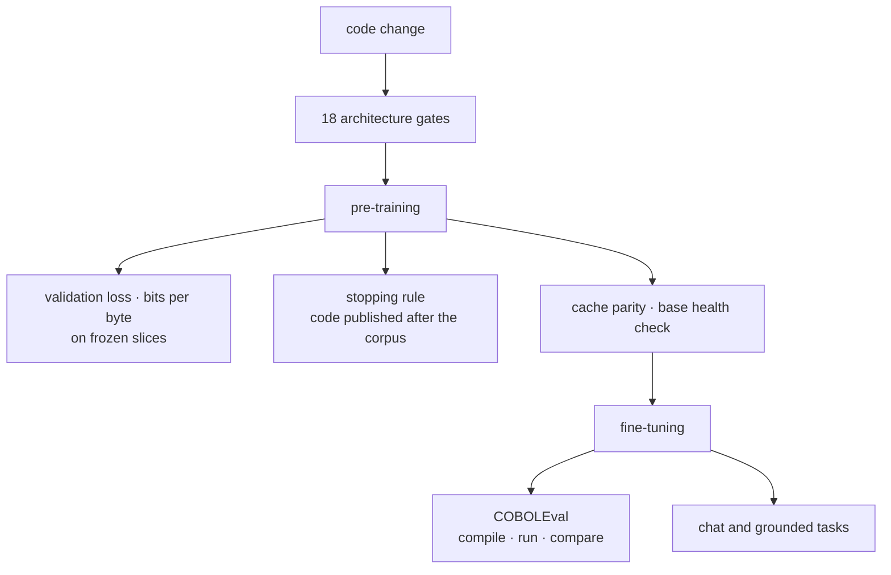

# `eval/` · how we know a model works

Every stage has its own test, from a change to the architecture to the released weights. Most of them are
pass or fail, and none of them trusts the training loss alone.



## COBOLEval: does the COBOL compile, run and return the right answer?

[COBOLEval](https://github.com/BloopAI/COBOLEval) (BloopAI, MIT) turns the 146 HumanEval problems into
COBOL subprograms. [`bin.coboleval.py`](bin.coboleval.py) asks the model for each program, links it with the
calling program of every test, compiles both with GnuCOBOL, runs the binary and compares the value it writes
with the expected one. It reports two numbers:

- **CSR** (compile success rate): the share of problems whose program compiles;
- **pass@1:** the share whose program compiles and passes every test.

**To reproduce the published result of Skylar-980M-Cobol:**

```bash
git clone https://github.com/BloopAI/COBOLEval eval/COBOLEval             # the problems, not vendored here
micromamba create -y -p tools/gnucobol-env -c conda-forge gnucobol=3.2   # GnuCOBOL 3.2, no root needed

COBC=tools/gnucobol-env/bin/cobc python eval/bin.coboleval.py \
    --model Skyl4r-Ai/Skylar-980M-Cobol --greedy --out samples.jsonl
```

| model | CSR | pass@1 | decoding |
|:--|--:|--:|:--|
| Skylar-980M-Cobol | **80.1%** | **7.5%** | greedy, seed 0, 146 problems |

**Checked:**
- On the samples of the published run, this scorer gives the published numbers, with the same outcome on
  every one of the 146 problems.
- Greedy generation from the checkpoint on the Hub reproduces those samples byte for byte, on the problems
  we compared.

**Other models** are scored by the same code: `--samples file.jsonl` takes one `{"task_id", "completion"}`
per line, generated anywhere.

GnuCOBOL 3.2 is required. The 3.1 package of Ubuntu does not accept the source format COBOLEval compiles
with, and every program would look like a compile failure, so the scorer stops if it finds 3.1.

## Before training: is the code right?

[`bin.gate_arch_v2.py`](bin.gate_arch_v2.py) runs 18 checks in seconds, and exits with 1 if any fails.

| gate | question |
|:--|:--|
| v1 parity | with every Skylar 2 option off, are the logits bit-identical to the frozen code the published models were trained with? |
| parameter count | does every component cost exactly the parameters the formula says? |
| initialisation | did every matrix receive its initialisation, including the new ones? |
| hybrid wiring | is every layer the type the config asks for? |
| document isolation | does the recurrent state stop at document boundaries in packed sequences? |
| cache | does generation with the cache match a full recomputation? |
| Attention Residuals | does the fused kernel match a float64 reference, forward and backward? |
| checkpointing | are gradients the same with and without activation checkpointing? |
| KDA without CUDA | does the PyTorch recurrence match the Triton kernel? |

```bash
python eval/bin.gate_arch_v2.py                  # preset test, seconds
python eval/bin.gate_arch_v2.py --preset 1B_D    # the real size
python eval/bin.gate_encoders.py                 # the dense, sparse and classifier encoders, dense and hybrid
```

[`bin.arch_ablation.py`](bin.arch_ablation.py) is the ablation protocol of the report. It trains one proxy
per variant and seed, and evaluates all of them on the same fixed windows, so differences are paired by
seed. It resumes where it stopped.

## During pre-training: is it learning, and is it better than before?

- **Validation cross-entropy** on fixed windows, from the trainer, at every evaluation.
- **Bits per byte** ([`bin.bits_per_byte.py`](bin.bits_per_byte.py)).
  - Why: perplexity cannot compare models with different vocabularies, because a bigger token carries more
    bytes. Bits per byte divides by the bytes of the text itself, so every model is measured in the same
    unit.
  - The set: four frozen slices (real COBOL, synthetic COBOL, general code, Italian legal text), measured
    separately, so a gain on one cannot hide a loss on another.
  - The texts come from our corpus and are not published; their sizes are in
    [`frozen_bytes/manifest.json`](frozen_bytes/manifest.json).
- **The stopping rule**, fixed before the run.
  - The set: code and COBOL from repositories created after 1 August 2026, and Italian articles from
    September 2026, all published after both of our corpora were closed. It is not filtered against the
    corpora, so copies of older code may remain.
  - The rule: at 20B tokens, the 990M model must reach fewer bits per byte on that code than the previous
    980M model at the end of its whole run (0.512); otherwise the run stops.
  - [`postcutoff_bytes/manifest.json`](postcutoff_bytes/manifest.json) lists every repository, commit,
    path and hash, so the set can be rebuilt. The texts are not redistributed.

## After pre-training

| tool | question | pass |
|:--|:--|:--|
| [`bin.cache_parity.py`](bin.cache_parity.py) | on trained weights, does decoding with the cache give the same tokens as recomputing everything? | fp32 argmax identical at every step |
| [`bin.eval_base_model.py`](bin.eval_base_model.py) | is the base ready for fine-tuning? perplexity, coherence, staying on topic, loops, leaked training artefacts | read the report |

## After fine-tuning

| tool | question |
|:--|:--|
| [`bin.coboleval.py`](bin.coboleval.py) | does the COBOL compile, run and return the right answer? (above) |
| [`validate_chat.py`](validate_chat.py) | does the chat model answer sensibly, and does it stop, emitting `<\|im_end\|>`? |
| [`validate_grounded.py`](validate_grounded.py) | the tasks a small model is for: answer from context, classify, extract JSON, refuse when the answer is absent |
| [`bin.diagnose_sft.py`](bin.diagnose_sft.py) | eight checks on the "never stops" failure: special tokens, loss mask, the probability of `<\|im_end\|>` |
| [`bin.diagnose_sft_drift.py`](bin.diagnose_sft_drift.py) | why a chat model talks nonsense: tokenisation, mask, drift from the base, embedding health |
| [`bin.eval_sft_model_token_stop.py`](bin.eval_sft_model_token_stop.py) | a quick probe: the raw tokens a chat model emits after a greeting |

## Public benchmarks

**Italian generation** ([`bench_ita.py`](bench_ita.py)): multiple choice scored by likelihood, the method of
lm-eval-harness.

| | Skylar-236M-Base | random |
|:--|:-:|:-:|
| XCOPA-it | **0.562** | 0.50 |
| HellaSwag-it | 0.292 | 0.25 |
| Belebele-it | 0.267 | 0.25 |

**Italian retrieval** ([`bench_retrieval.py`](bench_retrieval.py)): SQuAD-it test, 7,609 questions over
1,988 contexts, the same search and metrics for every model.

| model | parameters | R@1 | nDCG@10 |
|:--|--:|--:|--:|
| Skylar-236M-Embed | 236M | 0.55 | 0.71 |
| multilingual-e5-base | 278M | 0.71 | 0.83 |
| bge-m3 | 568M | 0.70 | 0.83 |

The 236M embedder does not beat these models on accuracy: it reaches 86% of the nDCG of bge-m3 at 2.4×
fewer parameters, from the same base as the chat model. Details and limits are in
[`docs/RESULTS.md`](../docs/RESULTS.md). [`eval_embeddings.py`](eval_embeddings.py) is the in-domain check,
with held-out phrasings.

## Data

[`bin.dataset_diagnostic.py`](bin.dataset_diagnostic.py) reports documents and tokens per source and flags
an unbalanced corpus. [`bin.dataset_diagnostic_sft.py`](bin.dataset_diagnostic_sft.py) does the same for a
conversation dataset.
