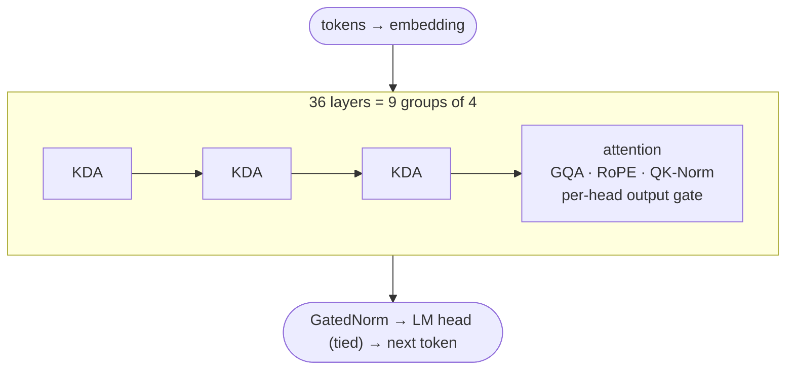
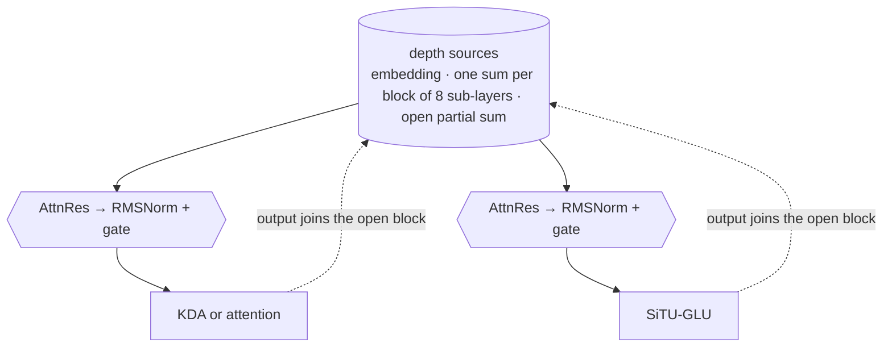

# `models/` · the Skylar 2 architecture

One decoder, [`Skylar2ForCausalLM`](decoder.py), configured by [`Skylar2Config`](config.py)
(`model_type` `skylar2`). Skylar 2 is a set of options on that decoder. With every option off, the model
is the base decoder of [`docs/PAPER.md`](../docs/PAPER.md), bit for bit, so every published checkpoint
still loads and generates as before. The frozen copy of that earlier code is in [`__old/`](__old/README.md).

The design, the ablations and every number on this page come from the technical report:
[`docs/PAPER_V2.md`](../docs/PAPER_V2.md) ([PDF](../docs/paper/skylar2_paper.pdf)).

> **Status:** no Skylar 2 model has been trained at scale yet. The architecture was selected on a
> 146M proxy with the depth of the 990M model, and the 990M training step is measured on B200, A100 and
> RTX 4090.

## At a glance



Inside every layer, each of the two sub-layers reads its input from earlier depths through block Attention
Residuals, and its output joins the block being built.



## Components

| component | trainer flag | what it does | report |
|:--|:--|:--|:--|
| **KDA hybrid, 3:1**<br>[`layers/kda.py`](layers/kda.py) | `--kda_ratio 3:1` | 27 of 36 layers are recurrent: a matrix state updated by the gated delta rule instead of a KV cache. Every fourth layer, the last included, keeps full attention for exact recall | §3.2 |
| **Block Attention Residuals**<br>[`layers/attn_res.py`](layers/attn_res.py) | `--attn_res`<br>`--attn_res_mode block`<br>`--attn_res_block_size 8` | each sub-layer reads a softmax mixture of the embedding, one sum per completed block of 8 sub-layers, and the open partial sum. Fused Triton kernel with the pre-norm folded in | §3.3 |
| **GatedNorm**<br>[`layers/norm.py`](layers/norm.py) | `--gated_norm 16` | a rank-16 sigmoid gate after each pre-norm and the final norm | §3.4 |
| **Output gate**<br>[`layers/attention.py`](layers/attention.py) | `--attn_out_gate perhead` | a sigmoid gate on the attention output, one value per head | §3.5 |
| **SiTU-GLU**<br>[`layers/ffn.py`](layers/ffn.py) | `--hidden_act situ_glu` | SwiGLU with both factors soft-clipped: equal to SwiGLU for small activations, bounded by β₁β₂ = 100 for large ones | §3.6 |
| **Muon**<br>[`../training/optim.py`](../training/optim.py) | `--optimizer muon` | Muon on the hidden linear maps, AdamW on everything else | §6.6 |
| RoPE<br>[`layers/rope.py`](layers/rope.py) | on by default (`--nope` removes it) | kept on the attention layers | §3.7 |
| Multi-token prediction<br>[`mtp.py`](mtp.py) | `--mtp_layers` | implemented and measured, not adopted: same loss, 11% slower | §3.7 |

**Recurrent heads at parameter parity.** KDA has no grouped-query compression, so copying the head
count of the source architecture inflates the model by 16% at 990M. The config sizes the recurrent
layers at the cost of the attention layer they replace: `kda_heads = (n_heads + n_kv_heads) / 2`. The
hybrid then costs 1 to 2% more parameters than the base decoder.

## What it buys

On a 146M proxy with the depth and layer layout of the 990M model, 30M tokens of the pre-training
mixture, three paired seeds (report §6.2, §6.6):

| step | validation cross-entropy | bits per byte | bits per byte, real COBOL |
|:--|--:|--:|--:|
| hybrid, no AttnRes | 4.946 | 1.187 | 0.962 |
| + block AttnRes | 4.868 | 1.165 | 0.968 |
| + GatedNorm | 4.636 | 1.042 | 0.774 |
| **+ Muon (Skylar 2)** | **4.344** | **0.919** | **0.667** |

Each step lowers validation cross-entropy and mean bits per byte in all three seeds. Bits per byte fall
by 23% overall and by 31% on real COBOL.

<p align="center">
  
</p>

**Against a dense Transformer** with the same components, the hybrid neither saves nor wastes training
compute at this scale (§6.7). It pays off in generation, where the recurrent layers keep a state of fixed
size instead of a cache that grows with the context (§6.9, 990M model, RTX 4090):

| per sequence | dense | Skylar 2 |
|:--|--:|--:|
| cache at 8,192 tokens | 0.57 GiB | **0.16 GiB** |
| cache at 32,768 tokens | 2.26 GiB | **0.58 GiB** |
| cache at 65,536 tokens | 4.51 GiB | **1.14 GiB** |
| decode, 32 prompts × 2,048 tokens | 528 tok/s | **982 tok/s** |
| decode, 8 prompts × 32,768 tokens | does not fit in 24 GB | **128 tok/s** |

## Build it

```python
from models.config import get_config
from models.decoder import Skylar2ForCausalLM

config = get_config(
    "1B_D", vocab_size=64000,
    kda_ratio="3:1",
    attn_res=True, attn_res_mode="block", attn_res_block_size=8,
    gated_norm=16, attn_out_gate="perhead", hidden_act="situ_glu",
)
model = Skylar2ForCausalLM(config)       # 1,026,781,656 parameters
print(config.layer_types[:4])            # ['kda', 'kda', 'kda', 'attention']
```

- On a CUDA GPU, the recurrent layers and the fused AttnRes run on the Triton kernels of
  [flash-linear-attention](https://github.com/fla-org/flash-linear-attention) (MIT, pinned in
  `requirements.txt`).
- On CPU and MPS the same computation runs in plain PyTorch: slower, same results. Only the kernels come
  from fla: the projections, the sizing, the cache and the initialisation are ours, and no third-party
  weights are used.
- In packed training, pass `document_ids` to `forward()`. With recurrent layers it is required: it
  stops the state from flowing from one document into the next (the trainer refuses `--kda_ratio`
  without `--doc_masking`).

## Sizes

Parameter counts with the 64,000-token vocabulary of the code line, counted by instantiating each model.

| preset | width | layers | heads (q / kv) | KDA heads | base decoder | Skylar 2 |
|:--|--:|--:|:--:|--:|--:|--:|
| `1B_D` (990M) | 1536 | 36 | 12 / 4 | 8 | 1,004,395,008 | **1,026,781,656** |
| `2b` | 2048 | 36 | 16 / 4 | 10 | 2,094,164,992 | 2,123,576,846 |
| `4b` | 2560 | 36 | 32 / 8 | 20 | 3,797,351,936 | 3,842,175,772 |
| `8b` | 4096 | 36 | 32 / 8 | 20 | 7,208,219,648 | 7,268,741,404 |
| `14b` | 5120 | 40 | 40 / 8 | 24 | 13,540,162,560 | 13,624,190,160 |

Only the 990M has been run: the larger sizes are what the code builds, with no measurement yet.

### Training throughput of the 990M, measured

| GPU | setup | tokens / s | peak memory |
|:--|:--|--:|--:|
| NVIDIA B200 (180 GB) | 4 × 8,192 tokens per micro-batch, no activation checkpointing, `--compile` | **53,000** | 139 GiB |
| NVIDIA A100 SXM (80 GB) | 1 × 8,192 tokens per micro-batch, no activation checkpointing, `--compile` | 14,036 | 50 GiB |
| RTX 4090 (24 GB) | 1 × 8,192 tokens per micro-batch, activation checkpointing, `--compile` | 6,727 | 17.6 GiB |

At the B200 rate, 300B tokens take about 1,570 GPU-hours.

## Checking it

```bash
python eval/bin.gate_arch_v2.py                 # 18 gates: v1 parity, init, cache, document isolation,
                                                # fused kernel against fp64, checkpointing, KDA without CUDA
python eval/bin.cache_parity.py --ckpt <dir>    # generation cache against full recomputation, on a trained checkpoint
python eval/bin.arch_ablation.py --data <tokenized_dir> --out runs/ablation   # the ablation protocol of the report
```

## Checkpoints and names

```python
import models.decoder                            # registers both names with transformers
from transformers import AutoModelForCausalLM

model.save_pretrained("my-skylar")
model = AutoModelForCausalLM.from_pretrained("my-skylar")
```

Checkpoints saved before 30/09/2026, the published Skylar-236M and Skylar-980M-Cobol, carry the earlier
name `NanoTransformer` (`nano-transformer`). Both `Skylar2ForCausalLM.from_pretrained` and
`AutoModelForCausalLM.from_pretrained` open them unchanged: their `config.json` has none of the Skylar 2
fields, and every default reproduces the base decoder.

The generation cache of a hybrid model is heterogeneous: the attention layers keep `(k, v)` tensors, the
KDA layers keep `(recurrent state, convolution states)`. `forward()` and `generate()` handle both;
[`layers/kv_cache.py`](layers/kv_cache.py) validates only the attention entries.

## The base decoder

The layers every Skylar model shares, with or without the Skylar 2 options:

| part | implementation | note |
|:--|:--|:--|
| normalisation | RMSNorm, pre-norm, computed in fp32 | [`layers/norm.py`](layers/norm.py) |
| positions | RoPE with configurable θ, NeoX rotate-half, cache extended on demand | [`layers/rope.py`](layers/rope.py) |
| attention | GQA, QK-Norm before RoPE, explicit `d_head` (Q/O projections can be rectangular, as in Qwen3) | [`layers/attention.py`](layers/attention.py) |
| feed-forward | SwiGLU, or SiTU-GLU | [`layers/ffn.py`](layers/ffn.py) |
| embeddings | tied to the output head below 8B | [`decoder.py`](decoder.py) |
| scaling | optional µP: width-scaled init, per-group learning rate, 1/d_head attention, output scaling | `mup_base_d_model` |

**Three attention paths**, picked from the arguments:
1. FlexAttention with a document block mask, for packed training (PyTorch ≥ 2.5, compiled on its own);
2. SDPA with a dense mask, as a fallback;
3. causal SDPA with a KV cache, for generation.

**Qwen3 parity.** The `4b`, `8b`, `14b` and `32b` presets have the shapes of the official Qwen3 models,
checked against their `config.json`. Only the vocabulary differs.

### All presets

Base decoder, vocabulary 64,000.

| preset | parameters | width | heads (q / kv) | d_head | layers | d_ff | context | RoPE θ |
|:--|--:|--:|:--:|--:|--:|--:|--:|--:|
| `test` | 8.8M | 128 | 4 / 4 | 32 | 4 | 256 | 4K | 100K |
| `small` | 52M | 512 | 8 / 4 | 64 | 8 | 1024 | 8K | 500K |
| `small_plus` | 88M | 640 | 10 / 5 | 64 | 10 | 1792 | 16K | 1M |
| `medium` | 125M | 768 | 12 / 4 | 64 | 12 | 2048 | 16K | 1M |
| `medium_plus` | 268M | 1024 | 16 / 4 | 64 | 18 | 2816 | 16K | 1M |
| `large` | 381M | 1024 | 16 / 4 | 64 | 28 | 2816 | 16K | 5M |
| `gold` | 426M | 1280 | 10 / 2 | 128 | 20 | 3456 | 16K | 1M |
| `1B` | 1.04B | 1536 | 16 / 4 | 96 | 32 | 5120 | 32K | 5M |
| `1B_D` | 1.00B | 1536 | 12 / 4 | 128 | 36 | 4096 | 16K | 1M |
| `2b` | 2.09B | 2048 | 16 / 4 | 128 | 36 | 7168 | 32K | 1M |
| `4b` | 3.80B | 2560 | 32 / 8 | 128 | 36 | 9728 | 32K | 1M |
| `8b` | 7.21B | 4096 | 32 / 8 | 128 | 36 | 12288 | 32K | 1M |
| `14b` | 13.5B | 5120 | 40 / 8 | 128 | 40 | 17408 | 32K | 1M |
| `32b` | 31.5B | 5120 | 64 / 8 | 128 | 64 | 25600 | 128K | 1M |
| `64b` | 62.1B | 8192 | 64 / 8 | 128 | 72 | 28672 | 128K | 1M |
| `96b` | 99.6B | 10240 | 80 / 8 | 128 | 80 | 32768 | 128K | 1M |
| `128b` | 128B | 11264 | 88 / 8 | 128 | 92 | 32768 | 128K | 1M |

The published 236M models use `medium_plus` with a 32,768-token vocabulary; Skylar-980M-Cobol uses
`1B_D` with 48,128.

### Configuration

```python
from models.config import get_config, Skylar2Config

config = get_config("medium")                                    # a preset
config = get_config("medium", vocab_size=40960, max_seq_len=32768)  # a preset with overrides
config = Skylar2Config(                                          # by hand
    vocab_size=40960, d_model=768, n_heads=12, n_kv_heads=4, n_layers=12, d_ff=2048,
    max_seq_len=16384, qk_norm=True, rope_theta=1_000_000.0,
    mup_base_d_model=256,                                        # µP against a 256-wide proxy
)
```

## Beyond generation

[`embedder.py`](embedder.py) (dense embeddings), [`sparse_encoder.py`](sparse_encoder.py) (SPLADE-style
sparse retrieval) and [`classifier.py`](classifier.py) reuse the decoder's weights through
`from_decoder()`, with the heads in [`heads.py`](heads.py). They build all-attention blocks, so today they
start from a base-decoder checkpoint such as Skylar-236M, not from a Skylar 2 hybrid.

## Files

| file | contents |
|:--|:--|
| [`config.py`](config.py) | `Skylar2Config`, the presets, `get_config()` |
| [`decoder.py`](decoder.py) | `Skylar2ForCausalLM`: forward, chunked loss, generation, µP parameter groups |
| [`layers/block.py`](layers/block.py) | the pre-norm block; picks KDA or attention from `layer_types` |
| [`layers/attention.py`](layers/attention.py) | GQA, RoPE, QK-Norm, output gate, FlexAttention document masks |
| [`layers/kda.py`](layers/kda.py) | Kimi Delta Attention, its cache and its PyTorch fallback |
| [`layers/attn_res.py`](layers/attn_res.py) | Attention Residuals (block, full, window) and the depth state |
| [`layers/norm.py`](layers/norm.py) | RMSNorm and GatedNorm |
| [`layers/ffn.py`](layers/ffn.py) | SwiGLU and SiTU-GLU |
| [`layers/rope.py`](layers/rope.py), [`layers/kv_cache.py`](layers/kv_cache.py) | rotary embeddings, cache helpers |
| [`mtp.py`](mtp.py) | multi-token prediction (off by default) |
| [`embedder.py`](embedder.py), [`sparse_encoder.py`](sparse_encoder.py), [`classifier.py`](classifier.py), [`heads.py`](heads.py) | the discriminative models |
| [`__old/`](__old/README.md) | the code the published checkpoints were trained with |
