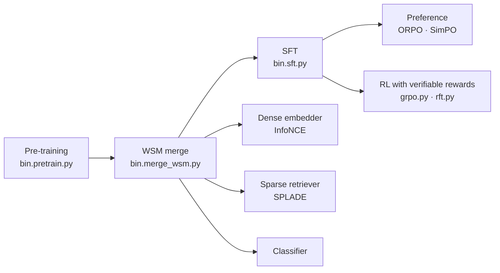

# `training/` · from pre-training to a usable model

One pre-trained decoder feeds every later stage. The chat model, the preference-tuned model and the
retrieval models all start from the same weights, with no second pre-training.



| stage | script | output |
|:--|:--|:--|
| pre-training | [`bin.pretrain.py`](bin.pretrain.py) | causal language model |
| checkpoint merge | [`bin.merge_wsm.py`](bin.merge_wsm.py) | the cooldown of a constant-LR run, done after training |
| supervised fine-tuning | [`bin.sft.py`](bin.sft.py) | ChatML chat model, loss on assistant tokens only |
| preference | [`bin.preference.py`](bin.preference.py) | ORPO or SimPO, reference-free (replaces DPO) |
| reinforcement learning | [`grpo.py`](grpo.py), [`rft.py`](rft.py) | GRPO and rejection-sampling fine-tuning with a pluggable verifiable reward |
| distillation | [`bin.distill.py`](bin.distill.py) | online logit distillation, full or top-k |
| dense embedder | [`bin.contrastive.py`](bin.contrastive.py) | `SkylarEmbedder` (InfoNCE, in-batch negatives) |
| sparse retriever | [`bin.sparse.py`](bin.sparse.py) | `SkylarSparseEncoder` (SPLADE-style) |
| classifier | [`bin.classify.py`](bin.classify.py) | `SkylarClassifier` |
| optimiser | [`optim.py`](optim.py) | Muon on the hidden matrices, AdamW on the rest |

The recipe for the post-training suite is in [`docs/POSTTRAIN.md`](../docs/POSTTRAIN.md).

## Pre-training

The trainer streams memory-mapped token shards (uint16 or uint32, see [`data/`](../data/README.md)),
runs on one GPU or many through Accelerate, and resumes after a crash with model, optimiser, RNG and
sampler state.

```bash
# a small model on one GPU
python training/bin.pretrain.py --preset medium --data <tokenized_dir> --tokenizer <tokenizer.json> \
    --seq_len 2048 --batch_size 8 --grad_accum 16 --lr 3e-4 --warmup 2000 --out checkpoints/medium

# resume where it stopped
python training/bin.pretrain.py ... --resume auto          # = <out>/last
```

**Skylar 2, the 990M launch configuration** (one B200; on smaller GPUs lower `--batch_size` and add
`--grad_ckpt`):

```bash
python training/bin.pretrain.py --preset 1B_D --data <tokenized_dir> --tokenizer <tokenizer.json> \
    --seq_len 8192 --batch_size 4 --grad_accum 32 \
    --kda_ratio 3:1 --attn_res --attn_res_mode block --attn_res_block_size 8 --gated_norm 16 \
    --attn_out_gate perhead --hidden_act situ_glu --optimizer muon --lr 2.3e-4 \
    --doc_masking --dropout 0 --lr_schedule constant --compile
```

`--doc_masking` is required with recurrent layers: without document boundaries the recurrent state would
flow from one packed document into the next, so the trainer refuses to start. The architecture flags are
explained in [`models/`](../models/README.md).

| feature | detail |
|:--|:--|
| data | memory-mapped shards with SHA-256 checksums; sampler without repeats (`--sampler permutation`); several tokenized folders with weights set at launch (`--data_mix`), which can change at a resume |
| schedules | `cosine`, `wsd` (warmup-stable-decay), `constant` |
| checkpoint merge | with `--lr_schedule constant --wsm_every_tok N` the trainer saves weight-only snapshots, and `bin.merge_wsm.py` averages the last ones (WSM, arXiv 2507.17634) |
| memory | loss computed in chunks, so the full logits never exist at once; optional activation checkpointing (`--grad_ckpt`) |
| checkpoints | Hugging Face format, `last` plus milestone snapshots (`--milestones`), optional async upload to S3 |
| telemetry | `metrics.jsonl` and `train_steps.jsonl`, optional W&B (`--wandb`); `status.json` and `heartbeat.json`; per-node power and energy from NVML (`--telemetry_s`); bits per byte on a frozen set during the run (`--bpb_set`) |
| long runs | `--deadline` and SIGTERM/SIGUSR1 save `last` and exit cleanly; `--ckpt_every_min` saves on a timer |

### More than one GPU

```bash
# one node
accelerate launch --num_processes 4 --mixed_precision no training/bin.pretrain.py ...

# several nodes, run on each node
torchrun --nnodes $NUM_NODES --node_rank $NODE_RANK --nproc_per_node 4 \
    --master_addr $MASTER_ADDR --master_port $MASTER_PORT \
    training/bin.pretrain.py ... --ckpt_per_node --resume auto
```

- **`--mixed_precision no` is deliberate.** bf16 is applied by the trainer around the forward pass;
  Accelerate's bf16 path would cast the full logits to fp32.
- **`--ckpt_per_node`** makes every node write its own `<out>/last`, for clusters without a shared disk.
  On resume the ranks check that they all start from the same step, and stop if they do not.
- **Resume on a different number of GPUs:** the sampler position is counted in samples, so a run can continue
  on more or fewer GPUs without repeating or skipping data.
- **`--ddp_comm bf16`** halves the gradient traffic between nodes; `--dist_timeout_min` turns a hung
  collective into an error.
- **Tested:** on 2 nodes × 4 A100, training and a per-node resume. Scaling efficiency on InfiniBand is
  not yet measured.

### On a Slurm cluster

[`slurm/`](slurm/README.md) runs one long pretraining as a chain of 24-hour jobs: a checkpoint every 30 minutes,
a watchdog for hung jobs, a GPU-hour budget the chain cannot exceed, day-1 checks of a new cluster, and the
pinned environment.

## Checkpoint merge

```bash
python training/bin.merge_wsm.py --snapshots_dir <out>/wsm --window_tok 20e9 --method mean --out <out>/merged
```

A uniform average of consecutive checkpoints of a constant-LR run is equivalent to a linear decay over that
window, so the cooldown is chosen after training, on a benchmark rather than on the loss.

## Supervised fine-tuning

```bash
python training/bin.sft.py --base_model <pretrained_dir> --data sft_train.jsonl --epochs 3 --lr 2e-5 --bf16
```

| feature | detail |
|:--|:--|
| format | ChatML (`<\|im_start\|>role … <\|im_end\|>`) |
| loss mask | only assistant tokens and the closing `<\|im_end\|>` carry gradient |
| stopping | extra weight on `<\|im_end\|>`, so the model learns to end its turn |
| optimiser | AdamW or Muon (`--optimizer`) |

## Remote training

Any GPU host works: install the repository, then run the same commands. There is nothing host-specific.
`utils/bin.download_aws_checkpoint.py` pulls checkpoints back from S3 when `--s3_bucket` was used.
